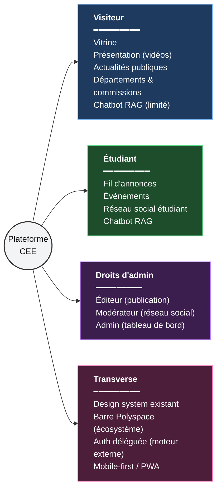
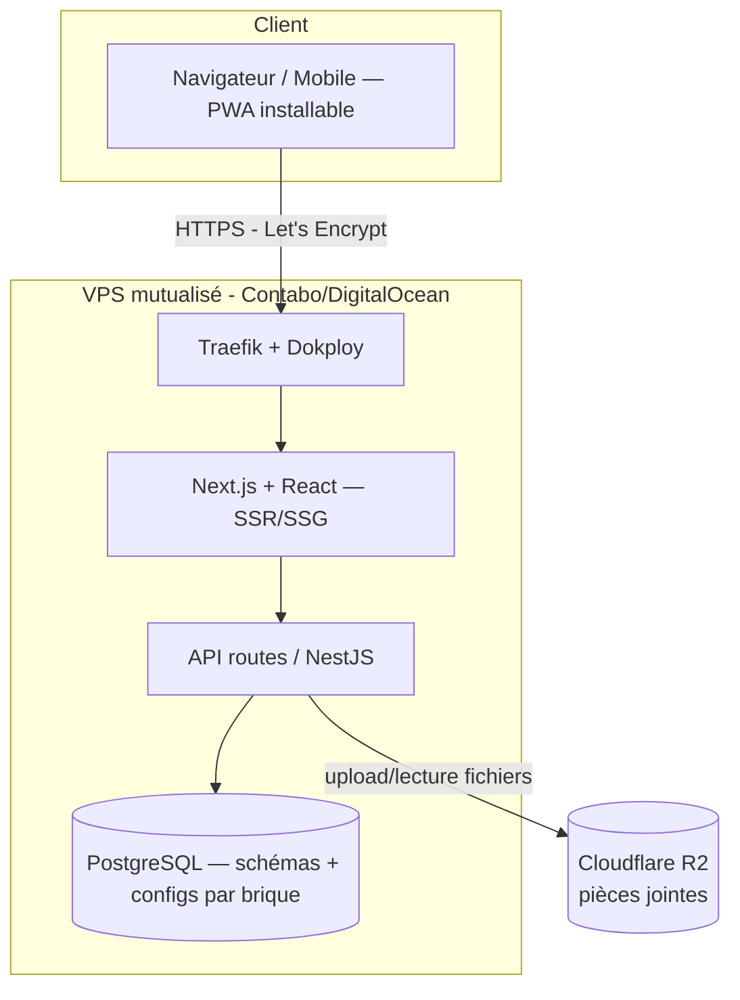

# 🧭 Plateforme CEE — Document de fusion

> [!info] Pourquoi ce document existe
> Deux documents décrivent **le même projet** : le [[CDC_Plateforme_CEE|CDC officiel]] (Commission IT, vision par *briques fonctionnelles* avec niveaux d'accès) et la [[Projet_plateforme_amicale|proposition Amicale]] (vision par *rubriques éditoriales*, calquée sur l'organigramme des commissions). **L'Amicale, c'est le CEE** — ce ne sont pas deux structures différentes.
>
> Ce fichier fusionne les deux : toutes les fonctionnalités des deux sources, réconciliées en une seule arborescence. **Le CDC fait autorité** sur la gouvernance, les priorités, les niveaux d'accès et les critères d'acceptation. **Le PDF Amicale** apporte l'arborescence de contenu, le mobile-first et la structuration éditoriale.

> [!tip] Comment lire ce document
> Ce n'est pas un CDC figé — c'est un **document de cadrage vivant**, issu d'une série de discussions de cadrage entre le Lead Dev et l'assistant. Trois types de blocs reviennent dans chaque section :
> - **Le contenu fonctionnel** (listes à puces, tableaux) : l'état actuel de la spec, déjà réconcilié entre le CDC et le PDF Amicale.
> - **🗒️ Journal de discussion** : chaque décision est accompagnée d'un **Pourquoi**, pour que quiconque (équipe dev, board) comprenne le raisonnement sans avoir à redemander.
> - **[!todo]** : points explicitement laissés ouverts, en attente d'une information externe ou d'un arbitrage qui n'appartient pas à cette discussion.
>
> **Le §12 "Registre des points ouverts" est le point d'entrée recommandé** pour l'équipe dev et le board de la Commission IT : il consolide tous les `[!todo]` du document en un seul endroit, groupés par qui doit trancher. Vos idées, propositions et décisions sont attendues en priorité sur ces points — chaque item renvoie à la section correspondante si vous voulez le contexte complet avant de répondre.

> [!important] Répartition en 5 modules de développement (2026-10-06)
> Ce document reste la référence de cadrage produit, mais le travail d'implémentation est découpé en **5 modules indépendants**, un par développeur, chacun avec son propre contrat d'interface, son schéma de données et sa part du registre ci-dessous :
> - [[Module_Fondations_Identite]] — socle (auth, rôles, layout, Polyspace, PWA, infra) — **aucune dépendance entrante**
> - [[Module_Diffusion_Vitrine_Evenements]] — annonces, vitrine, Présentation, événements, Formations
> - [[Module_Chatbot_RAG]] — assistant conversationnel RAG
> - [[Module_Reseau_Social]] — fil, groupes, messagerie, Social/Sport & Culture/Relations extérieures
> - [[Module_Administration_Comptes]] — import liste blanche, rôles, journal d'audit
>
> L'intégration inter-modules est portée par le Lead Dev, hors périmètre des fichiers modules eux-mêmes.

---

## 1. 🎯 Vue d'ensemble

La Plateforme CEE est l'outil numérique interne à l'ESP : développée, hébergée et maintenue par des étudiants, sous la responsabilité de la **Commission IT**, avec budget 0 FCFA (coût humain uniquement).

> [!note] Ce qui a changé (2026-09-29)
> Le suivi des dépenses **sort du périmètre de cette plateforme** — il devient un module de l'application de gestion interne du CEE, déjà réalisée par des tiers (voir Brique 2 ci-dessous). Les "droits d'admin" remplacent l'ancien "niveau 3", qui n'a plus d'objet ici.

> [!tip] Principe clé
> **Une seule app, un seul déploiement, un seul domaine** (`cee.domaine.com`), avec des vues différenciées selon le niveau d'accès de l'utilisateur — pas plusieurs sites séparés.

---

## 2. 🔐 Identité, authentification & niveaux d'accès

> [!important] Pivot architectural (2026-09-29) — remplace le modèle "3 niveaux" d'origine
> Suite aux [[Retours_CDC_Plateforme_CEE|retours officiels]] et à l'[[ADR_Identite_Ecosysteme_Etudiant|ADR-001]], le modèle d'authentification change en profondeur : plus de mot de passe, plus de niveau 3, et **le moteur d'authentification n'est plus développé par nous**. Le détail historique de l'ancien modèle (niveau 3, JWT maison, 2FA TOTP) reste conservé en §2.1 pour traçabilité, mais **il est superseded — ne pas l'implémenter**.

### Modèle retenu

| Niveau / rôle | Nature | Attribué par |
|---|---|---|
| **Visiteur** | Public, sans compte | Par défaut |
| **Étudiant** | Compte Google reconnu sur liste blanche | Moteur d'auth partagé, à partir des imports/ajouts gérés sur notre plateforme |
| **Éditeur** | Droit d'administration additif — publication (annonces, événements) | Géré **localement** sur la plateforme CEE |
| **Modérateur** | Droit d'administration additif — modération réseau social | Géré **localement** sur la plateforme CEE |
| **Admin** | Droit d'administration additif — administration générale du tableau de bord | Géré **localement** sur la plateforme CEE |

> [!note] "Responsable de classe" — une permission, pas un rôle à part
> Ce n'est **pas** une ligne distincte de ce tableau : c'est une **permission spéciale attachée au statut Étudiant** (n'importe quel étudiant peut la détenir pour sa propre classe), pas un 6ᵉ rôle du modèle. Elle donne uniquement le droit d'ajouter un étudiant manquant à sa classe (§ écrans de gestion ci-dessous) — aucun droit d'administration additif.

> [!warning] Point critique, inchangé dans son principe
> L'authentification et l'autorisation restent **la pièce centrale du produit**, même si on n'en implémente plus le moteur. Ce qui reste de notre responsabilité : les écrans de gestion de la liste blanche, la synchronisation du profil local, et l'attribution des droits d'administration spécifiques à notre plateforme.

- **Moteur d'authentification = module externe mutualisé**, développé et hébergé par une équipe dédiée, partagé par la Plateforme CEE, [[Projet_Hints|Hints]], [[Projet_Plateforme_Vote|Vote]] et [[Projet_Guide_Logiciels_Etudiants|Guide Logiciels]]. Connexion **Google OAuth2 exclusivement** — plus de mot de passe, plus de JWT/refresh token maison, plus de 2FA à construire nous-mêmes.
- **Écrans de gestion de la liste blanche = notre responsabilité** : import Excel par structure départementale, ajout d'un étudiant manquant par le **responsable de classe** (limité à sa propre classe, chaque ajout tracé, aucun droit sur les adresses). Ces écrans **poussent** les identités whitelistées vers le moteur d'auth partagé via son API — le moteur d'auth reste la source de vérité unique pour tout l'écosystème étudiant.
- **Profil local synchronisé en base** : à la connexion, notre plateforme reçoit l'identité vérifiée (token OIDC) et synchronise une table locale (identifiant externe, nom, email, département, classe/promo, statut étudiant/visiteur) — c'est notre façon de savoir "qui est dans notre plateforme" au niveau BD, indépendamment du moteur d'auth.
- **Droits d'administration (éditeur, modérateur, admin) stockés et gérés localement**, pas dans le moteur d'auth partagé — spécifiques à ce qu'une personne peut faire sur la Plateforme CEE, sans pertinence pour Hints/Vote/Guide Logiciels.
- Toute élévation de privilège locale (attribution éditeur/modérateur/admin) reste **loggée** (audit trail, principe conservé de l'ancien modèle).

**🗒️ Journal de discussion (2026-09-29)**

> [!quote] Décisions actées — Lead Dev × assistant
> - **Moteur d'auth délégué à une équipe dédiée mutualisée**, écrans de gestion conservés côté plateforme CEE.
>   **Pourquoi** : coordination inter-projets (Hints, Vote, Guide Logiciels) — construire et maintenir un moteur d'authentification soi-même est la brique la plus sensible et la plus coûteuse en expertise de tout l'écosystème ; la mutualiser réduit la charge de chaque équipe projet tout en gardant une connexion unique pour l'étudiant. Garder les écrans de gestion chez nous a du sens car l'import des listes départementales est un processus **métier propre au CEE** (structures départementales, responsables de classe), pas une fonctionnalité générique que l'équipe auth devrait porter.
> - **Liste blanche poussée vers le moteur d'auth** (pas l'inverse).
>   **Pourquoi** : cohérent avec la conception d'origine de l'ADR-001 — le moteur d'auth doit rester la source de vérité unique pour tout l'écosystème (Hints, Vote, Guide Logiciels inclus), pas seulement pour notre plateforme. Si chaque plateforme consommatrice devait interroger la nôtre pour savoir "qui est étudiant", on recréerait une dépendance croisée fragile ; pousser vers un point central unique évite ça.
> - **Profil local synchronisé en base**, séparé du moteur d'auth.
>   **Pourquoi** : répond directement au besoin exprimé — même si on ne gère plus l'authentification, on a toujours besoin de savoir qui utilise la plateforme pour appliquer nos propres règles (contenu visible, droits d'administration, filtres par département/classe). Un profil local synchronisé à la connexion (JIT — *just-in-time provisioning*) évite de dépendre d'un appel réseau vers le moteur d'auth à chaque page vue.
> - **Droits d'administration (éditeur/modérateur/admin) gérés localement**, pas dans le moteur d'auth partagé.
>   **Pourquoi** : ces rôles n'ont de sens que sur la Plateforme CEE (publier une annonce, modérer le réseau social...) — les faire porter par le moteur d'auth mutualisé aurait mélangé des responsabilités spécifiques à un projet avec un service générique partagé par 4 projets différents.
> - **Ajout par le responsable de classe** confirmé, malgré la décision du 10/08 qui l'excluait.
>   **Pourquoi** : repris tel quel de l'ADR-001 — le garde-fou (limité à sa classe, tracé, sans droit sur les adresses) rend le risque acceptable, et ça résout un problème réel (listes départementales incomplètes) sans donner un pouvoir disproportionné à une seule personne.

**Relecture de cohérence (2026-09-29) — 2 décisions complémentaires :**

> [!quote] Décisions actées — Lead Dev × assistant
> - **"Responsable de classe" = permission attachée au statut Étudiant**, pas un rôle séparé.
>   **Pourquoi** : cette permission ne donne qu'un droit très étroit (ajouter un étudiant à sa propre classe), sans rapport avec les droits d'administration (publication, modération, admin général) — en faire un rôle à part aurait ajouté une entrée au modèle pour une capacité qui reste fondamentalement celle d'un étudiant parmi d'autres.
> - **Publication directe, sans étape de validation séparée** (Brique 1 et Événements) — voir journaux respectifs.
>   **Pourquoi** : cohérence avec le modèle plat — inventer un rôle "validateur" aurait contredit la simplification déjà actée par les retours ("le filtre par commission n'est pas nécessaire").

### 2.2 🏗️ Architecture technique précisée par l'équipe auth dédiée (2026-10-06)

> [!important] Document source : [[Authentification-CEE]]
> L'équipe dédiée au moteur d'authentification (Keycloak) a publié son architecture pour tout l'écosystème étudiant (CEE, Hints, Vote, Guide Logiciels). Ce qui suit **précise et confirme** le modèle acté le 2026-09-29, avec des détails techniques concrets qu'on n'avait pas encore.

- **Séparation identité/autorisation confirmée** : Keycloak stocke uniquement `nom`, `prénom`, `email`, `enabled` (identité). **Tous les rôles restent de notre ressort** (Éditeur/Modérateur/Admin, déjà décidé §2) — exactement le découpage qu'on avait anticipé.
- **Clé pivot = UUID Keycloak** (claim `sub` du JWT), **pas l'email**, comme clé primaire de notre table `users` locale. L'email peut changer sans casser l'intégrité référentielle de nos données métier — à corriger dans notre modèle de profil local si on avait imaginé l'email comme identifiant stable.
- **Filtrage de domaine à implémenter côté applicatif** (pas géré par Keycloak) : seuls `@esp.sn` et `@gmail.com` sont acceptés ; tout autre domaine (ex. `@ucad.edu.sn`) doit être **rejeté avec un 403** au décodage du JWT/des en-têtes du reverse proxy. C'est un bout de code à écrire nous-mêmes à l'entrée de chaque route protégée.
- **Aucun provisioning libre** : seuls les comptes pré-chargés dans Keycloak peuvent se connecter — confirme notre principe de liste blanche.
- **Synchronisation annuelle de rentrée** (~7000 étudiants) : upsert automatisé via l'API REST d'administration Keycloak, **un script séparé** de nos propres écrans de gestion. Nos écrans (import Excel par structure départementale, ajout par responsable de classe) couvrent les **ajustements ponctuels en cours d'année**, pas le bulk annuel.
- **⚠️ Purge des comptes inactifs après 6 mois** : Keycloak supprime **définitivement** l'UUID, sans garantie d'événement de synchronisation vers nos bases locales. Exigence explicite de l'équipe auth, applicable à toute notre modélisation :
  - **Interdiction du `CASCADE` destructeur sur l'identité** — supprimer un profil local ne doit jamais supprimer les données d'intérêt collectif qu'il a générées (posts, annonces, journal d'audit).
  - **Persistance de l'historique garantie** : toute entité qui doit rester compréhensible/vérifiable après le départ d'un étudiant (ex. un post signé, une ligne d'audit trail) doit conserver une trace textuelle ou un état, **sans dépendre de l'existence active du compte**.

**🗒️ Journal de discussion (2026-10-06)**

> [!quote] Décisions actées — Lead Dev × assistant
> - **UUID comme clé pivot plutôt que l'email**, repris tel quel de la spec de l'équipe auth.
>   **Pourquoi** : c'est une exigence technique externe, pas un choix de conception de notre côté — l'email n'est pas un identifiant stable (changement de compte possible), l'UUID Keycloak l'est.
> - **Filtrage de domaine (`@esp.sn`/`@gmail.com`) implémenté par nous**, pas par Keycloak.
>   **Pourquoi** : l'équipe auth a choisi de déléguer ce contrôle au niveau applicatif pour que chaque plateforme garde la main sur ses propres règles d'accès fines — on doit donc l'ajouter explicitement à notre spec technique, ce n'était pas couvert avant.
> - **Annuel (bulk, script) vs ponctuel (nos écrans)** : les deux canaux coexistent, pas de conflit.
>   **Pourquoi** : le bulk annuel traite ~7000 comptes d'un coup à la rentrée (hors de notre portée), nos écrans traitent les corrections/ajouts au fil de l'année — même logique que le flux "liste blanche poussée vers le moteur d'auth" déjà décidé, juste avec un deuxième canal plus massif en parallèle.
> - **Pas de CASCADE destructeur, historique préservé indépendamment du compte** — élevé en exigence transversale, pas seulement une note technique.
>   **Pourquoi** : c'est une contrainte dure de l'équipe auth (pas une suggestion) — un compte peut disparaître sans préavis après 6 mois d'inactivité. Si notre modèle de données dépend de l'existence du compte pour afficher un post, une annonce ou une ligne d'audit, on se retrouve avec des données orphelines ou un comportement cassé en production, potentiellement des mois après le départ de l'étudiant concerné — un bug très difficile à diagnostiquer après coup. Mieux vaut le concevoir dès le départ que le découvrir en prod.

> [!todo] Reste à obtenir / clarifier
> - [ ] Format exact des claims du token OIDC (au-delà de `sub`/email) et des endpoints admin pour pousser la liste blanche
> - [ ] Vérifier auprès de l'administration ESP si les adresses `@esp.sn` sont des comptes Google Workspace (simplifierait la liste blanche — hérité de l'ADR-001)
> - [ ] Concevoir avec les structures départementales le formulaire d'import (nom, adresse Gmail, département, promo, classe)
> - [ ] Mécanisme concret d'affichage pour un contenu dont l'auteur a été purgé (ex. "Compte supprimé" en remplacement du nom) — à spécifier au moment du modèle de données Brique 5/tableau de bord

---

### 2.1 🗒️ Journal historique — ancien modèle "3 niveaux" (2026-09-25, superseded)

> [!danger] Superseded — conservé pour traçabilité uniquement
> Tout ce qui suit décrivait le modèle d'authentification **avant** le pivot du 2026-09-29 (voir ci-dessus). Ne pas l'implémenter. Conservé pour comprendre le raisonnement historique et parce que certains éléments (ex. granularité des rôles par commission, organigramme requis) restent pertinents pour **d'autres documents** — notamment la spec du module dépenses de l'application de gestion interne, qui hérite de la logique "niveau 3" dans un contexte différent (voir Brique 2, désormais hors périmètre plateforme).

> [!quote] Contexte
> Discussion de cadrage entre le Lead Dev et l'assistant, point par point sur les 3 niveaux d'accès. Ce document sert de journal — chaque décision ci-dessous prime sur les zones d'ombre laissées par le CDC et le PDF Amicale d'origine.

**a) Fiabilité de l'inscription niveau 2 (étudiant)**
- Décision : deux options à spécifier en parallèle, à trancher selon ce qui est effectivement disponible :
  1. Le CEE obtient une **base étudiants officielle** (ESP/scolarité) → vérification directe à l'inscription.
  2. À défaut → **validation manuelle par un admin** depuis le back-office, sur chaque inscription déléguée.
- **Pourquoi** : le CDC lui-même signale l'inscription déléguée comme un point d'auth "ouverte, non vérifiée" — un risque déjà identifié, pas un oubli. Garder deux options ouvertes évite de bloquer le projet sur une dépendance externe (obtention de la base ESP) qui n'est pas garantie ; la validation manuelle est un filet de sécurité si la base n'arrive pas à temps. Dans les deux cas, l'intégrité des comptes reste non négociable car c'est la porte d'entrée de tout le système d'accès.

**b) Passage niveau 2 → niveau 3 (promotion "membre CEE")**
- Décision : **double validation, pour le moment** : Président de la Commission IT **+** Président du CEE. Workflow précis (conditions, étapes, déclencheur) à spécifier par le Président de la Commission IT.
- **Pourquoi** : la promotion niveau 3 donne accès à la brique la plus sensible (dépenses, art. 23/28 du RI) — une seule personne validant seule créerait un point de défaillance unique et un risque d'abus de pouvoir. La double validation crée un garde-fou minimal sans complexifier davantage à ce stade ; le "pour le moment" signale que ce n'est pas gravé dans le marbre tant que le workflow détaillé n'est pas écrit.

**c) Granularité des rôles niveau 3**
- Décision : le niveau 3 n'est **pas un rôle plat**. Rôles fins par commission (ex. `cee_member:finances`, `cee_member:comm`, `cee_member:president`...).
- **Pourquoi** : le CDC décrit déjà un circuit de validation à étapes pour la brique 2 (Finances valide → Président valide → Archivage), ce qui prouve que tous les membres CEE n'ont pas les mêmes droits dans la réalité. Un rôle unique `cee_member` masquerait cette hiérarchie et obligerait à coder des exceptions ad hoc plus tard ; autant modéliser la granularité dès le départ.
- 🔴 **Dépendance bloquante** : nécessite l'**organigramme officiel des commissions** pour lister les rôles réels — sans lui, tout modèle de permissions serait une supposition qu'il faudrait probablement refaire.

**d) Fin de mandat / rotation des accès**
- Décision : un ancien membre CEE **redevient automatiquement étudiant lambda** (niveau 2) en fin de mandat, perte immédiate de l'accès niveau 3.
- **Pourquoi** : les membres CEE tournent chaque année (le CDC le dit pour l'équipe dev, mais ça vaut tout autant pour le bureau exécutif) — laisser l'accès niveau 3 actif après le mandat exposerait les données de dépenses (confidentielles, art. 23/28 RI) à des personnes qui n'ont plus de mandat légitime pour les consulter. Ça impose un mécanisme technique de **désactivation liée à la durée du mandat**, et non une attribution permanente, pour que le contrôle d'accès reste synchronisé avec la réalité organisationnelle.

> [!todo] Dépendances externes à obtenir avant spec détaillée
> - [ ] Confirmation : base étudiants officielle disponible, ou validation manuelle uniquement ?
> - [ ] Organigramme des commissions (pour rôles fins niveau 3)
> - [ ] Workflow de promotion niveau 2 → 3, à produire par le Président Commission IT

---

## 3. 🧱 Les briques fonctionnelles (fusion complète)

Chaque brique ci-dessous fusionne : la brique correspondante du CDC **+** les rubriques équivalentes du PDF Amicale, marquées `🔹 PDF`.

### Brique 1 — Canal de diffusion `PRIORITÉ 1`

> [!success] Débloque la Phase 1 du projet Formations — ne doit pas attendre la brique 5. **Sous réserve du catalogue Formations, voir ci-dessous.**

- Liste d'annonces chronologique, filtrable par étiquette (**tags libres** pour le moment) — **plus de filtre par commission**, non nécessaire
- Annonces "publiées" → visiteur+étudiant ; annonces "internes" → étudiant uniquement
- **Rôle Éditeur** (§2/§4) publie **directement**, sans étape de validation séparée (pas de rôle "validateur" distinct)
- **Ciblage** : une annonce peut être adressée à un département ou une classe spécifique, à partir du profil local synchronisé (§2)
- **Brouillon, épinglage, date d'expiration** : une annonce peut être sauvegardée en brouillon avant publication, mise en avant (épinglée), et une annonce d'événement expire automatiquement une fois l'événement passé
- **Catalogue Formations** : publication et mise à jour de la liste des formations proposées par les clubs, condition réelle pour que cette brique débloque la [[Projet_Plateforme_Formations|Phase 1 de Formations]]
- **Notifications**, sur les trois canaux :
  1. Push PWA (l'app est installable dès M0, §6)
  2. Aperçu de lien soigné pour relais dans une chaîne WhatsApp officielle (stratégie multicanale du 10/08)
  3. Résumé par e-mail
- Pièces jointes : PDF, images **et vidéos**, avec limites de taille par type de fichier et garde-fous sécurité (anti bombe de décompression et vulnérabilités d'upload similaires)
- Stockage des pièces jointes : **Cloudflare R2** (coût minimal, libère le disque du VPS pour d'autres besoins)
- Recherche textuelle simple
- Flux RSS **distinct** de la table brute des annonces — n'expose que les annonces "publiées", jamais les internes (intégrité/confidentialité) — **utilité pour Yeekai à vérifier, voir registre §12**
- Page d'accueil (brique 3) et Brique 1 partagent **la même source de données** — une annonce non encore validée n'est jamais visible du public, ni sur le fil, ni en accueil
- 🔹 PDF — Bloc "actualités" + "annonces importantes" en page d'accueil, avec accès rapides vers les rubriques

**Critères d'acceptation**
- [ ] Annonce publiée visible en < 2 min (publication directe, sans étape de validation)
- [ ] Visiteur non connecté voit les annonces publiques
- [ ] Étudiant connecté voit les annonces internes, et celles ciblées sur son département/classe
- [ ] Une annonce d'événement expire automatiquement après la date de l'événement
- [ ] Contenu de base (liste + détail d'annonce) lisible **sans JavaScript** — rendu SSR ; filtres/recherche peuvent nécessiter JS (progressive enhancement partiel, option A)

**🗒️ Journal de discussion (2026-09-29) — mise à jour suite aux retours**

> [!quote] Décisions actées — Lead Dev × assistant
> - **Alignement sur le rôle Éditeur plat**, retrait du "chaque commission publie".
>   **Pourquoi** : cohérent avec le modèle d'auth simplifié (§2/§4) — les retours confirment explicitement que le filtre par commission n'est pas nécessaire pour la publication. Garder l'ancienne formulation aurait recréé une incohérence entre cette brique et le reste du document.
> - **Ciblage département/classe** ajouté.
>   **Pourquoi** : la donnée (département/classe) existe déjà dans le profil local synchronisé (§2) — ne pas l'exploiter pour cibler les annonces aurait laissé de la valeur sur la table pour un coût d'implémentation faible.
> - **Brouillon, épinglage, expiration** ajoutés, les trois.
>   **Pourquoi** : ce sont des mécaniques de publication basiques attendues de tout système d'annonces — leur absence aurait été un manque plus qu'un choix. L'expiration automatique évite en particulier qu'un visiteur découvre un événement déjà passé, ce qui nuirait à la crédibilité de la plateforme.
> - **Catalogue Formations** ajouté comme fonctionnalité à part entière.
>   **Pourquoi** : sans lui, l'affirmation du CDC ("M1 débloque Formations Phase 1") est fausse dans les faits — les retours l'ont identifié comme un trou réel, pas une nuance.
> - **Notifications sur les trois canaux** (push PWA, aperçu WhatsApp, résumé e-mail).
>   **Pourquoi** : les retours identifient l'absence de notification comme un vrai manque face à WhatsApp ("c'est ce qui fait sa force") — les trois canaux touchent des habitudes différentes (mobile installé, chaîne WhatsApp déjà suivie, e-mail pour les moins connectés), aucun des trois ne suffit seul.
> - **Publication directe, sans étape de validation séparée** (relecture de cohérence, 2026-09-29).
>   **Pourquoi** : le modèle plat (§2/§4) ne définit que Visiteur/Étudiant/Éditeur/Modérateur/Admin — le "Modérateur" est explicitement scopé au réseau social (Brique 5), pas aux annonces. Inventer un rôle "validateur" séparé aurait recréé une étape de circuit que les retours cherchaient justement à simplifier ("le filtre par commission n'est pas nécessaire"). La publication directe par l'Éditeur est la lecture la plus cohérente avec cette simplification.

**Décisions antérieures (2026-09-25), toujours valides :**

> [!quote] Décisions actées — Lead Dev × assistant
> - **Taxonomie** : tags libres pour le moment.
>   **Pourquoi** : imposer une liste fermée de tags dès maintenant demanderait de connaître l'organigramme et les usages réels des commissions, qu'on n'a pas encore (🔗 dépendance déjà notée en § 2.1). Des tags libres permettent de démarrer sans bloquer sur cette inconnue, quitte à structurer une taxonomie fermée plus tard une fois l'usage réel observé.
> - **Pièces jointes** : formats étendus aux vidéos, tailles à chiffrer par type, scan sécurité contre uploads malveillants (zip bombs, etc.), stockage **Cloudflare R2**.
>   **Pourquoi** : les vidéos sont un besoin réel exprimé (contenus pédagogiques, annonces) donc les exclure aurait limité artificiellement la brique. Le scan sécurité est une exigence directe du CDC §5.3 ("validation stricte des uploads") — sans garde-fou, un upload devient une porte d'entrée d'attaque (déni de service via zip bomb, exécution de fichier déguisé, etc.). R2 est choisi pour son coût quasi nul et parce que ça évite de saturer le disque du VPS mutualisé, qui doit rester disponible pour la base de données et les autres briques (cohérent avec la contrainte budget 0 FCFA du CDC).
> - **RSS** : flux public distinct, jamais un export direct de la table.
>   **Pourquoi** : un export brut de la table annonces exposerait mécaniquement tout ce qui y est stocké, y compris les annonces internes destinées uniquement aux étudiants connectés — ce qui violerait la séparation stricte des accès posée en §2. Un flux généré séparément permet d'appliquer explicitement le filtre "publié" avant toute sortie de données.
> - **Vitrine vs Brique 1** : source de données unique, filtre "publié" appliqué identiquement aux deux affichages.
>   **Pourquoi** : dupliquer la donnée entre vitrine et fil d'annonces créerait un risque de désynchronisation (une annonce retirée d'un côté mais visible de l'autre) et un travail de maintenance double pour rien — une seule source avec un filtre cohérent élimine ce risque par construction.
> - **Contrainte "sans JS"** : retenue **option A** — SSR pour le contenu de lecture, JS libre pour les interactions.
>   **Pourquoi** : l'option B (tout fonctionnel sans JS, y compris filtres et recherche) demanderait un fallback serveur pour chaque interaction, un effort disproportionné face à la contrainte de budget humain du CDC. L'option A respecte déjà l'esprit du critère d'acceptation (le contenu officiel doit rester consultable sans JS) sans alourdir le développement des fonctionnalités interactives.

> [!todo] Reste à chiffrer / vérifier
> - [ ] Taille max par fichier et par type (PDF / image / vidéo)
> - [ ] Liste des vulnérabilités à couvrir par le scan sécurité upload (zip bomb confirmé, autres à lister avec la revue sécurité §8)
> - [ ] **Vérifier auprès du Président de la Commission IT si Yeekai sait lire un flux RSS** — sinon, retirer le flux

---

### Brique 2 — Suivi des dépenses — **retirée de la plateforme (2026-09-29)**

> [!danger] Hors périmètre — ne pas implémenter sur cette plateforme
> Le suivi des dépenses devient un **module de l'application de gestion interne du CEE**, déjà réalisée par des tiers. On reprend cette application existante et on y ajoute le suivi des dépenses — ce n'est **pas** un développement de la Plateforme CEE. Fondement légal inchangé : art. 23 et 28 du [[Reglement_Interieur_CEE|Règlement Intérieur]], mais applicable à ce module, pas à nous.
>
> Les exigences fonctionnelles qu'on avait détaillées (circuit de validation par la Commission Finances, historique immuable/append-only, restitution de fin de mandat, confidentialité, étanchéité) **restent valables en tant que cahier des charges**, mais pour l'équipe qui porte l'application de gestion interne — pas pour nous. Le détail complet (circuit semi-configurable, gestion du rejet, 2FA, étanchéité triple niveau...) est conservé en repli ci-dessous, à titre de **référence transmissible** à cette équipe si utile, mais il ne doit plus être lu comme une spec de la Plateforme CEE.

🗄️ Ancienne spec détaillée (2026-09-25, superseded — pour référence uniquement)

**Public** : niveau 3 uniquement — **étanche**, aucune fuite vers niveau 1/2.

**Acteurs**
- Commission Finances : co-décideur (définit pièces, circuit, restitution)
- Commission IT : réalisation technique
- Tous membres du CEE : soumettent leurs dépenses

**Fonctionnalités**
- Création de dépense : montant, date, commission, catégorie, justificatifs (upload), commentaire — un membre ne soumet que pour sa propre commission
- Circuit de validation semi-configurable : Finances peut ajuster le circuit, mais uniquement dans les limites fixées par l'organigramme de la Commission Finances
- Dépense rejetée → renvoyée au soumetteur pour correction, statut "draft"/archive temporaire en attendant la re-soumission
- Tableau de bord : dépenses par commission / période / statut
- Export PDF/Excel de la restitution de fin de mandat — export global du mandat, sans filtre
- Historique append-only : toute correction se fait par écriture d'annulation/contre-écriture
- Authentification renforcée — 2FA obligatoire
- Étanchéité sur 3 niveaux : applicatif, passerelle/API, base de données

**Journal de discussion original (2026-09-25)** — raisonnement complet disponible dans l'historique de version de ce document si besoin de le retransmettre à l'équipe de l'application de gestion interne.

---

### Brique 3 — Site vitrine `PRIORITÉ 3`

**Public** : visiteur (voir §2).

- Accueil : identité du CEE, actualités publiques, liens rapides
- **Présentation** (🆕 retours 2026-09-29) : vidéos produites par la Commission Communication — campus, départements, campus social, vie étudiante. **Hébergées sur une chaîne YouTube du CEE**, intégrées par embed (pas de stockage sur notre infrastructure)
- Présentation des **6 départements académiques** (Génie Informatique, Génie Mécanique, Génie Chimique et Biologie Appliquée, Génie Électrique, Génie Civil, Gestion) — **page distincte** de la présentation des commissions du CEE
- Présentation des **commissions du CEE** (entités de gouvernance) — page séparée, alimentée par l'organigramme du CEE (dépendance allégée, voir §11/§12)
- **"Qui sommes-nous"** : page fusionnée en **2 sections** — (1) volet institutionnel/historique (histoire, missions, objectifs, bureau exécutif — 🔹 PDF "L'Amicale"), (2) volet mandat/légal (bureau, mandat, règlement intérieur — CDC)
- 🔹 PDF — **"Contact"** : page simple, canaux de communication principaux
- Mentions légales — contenu à valider avec le CEE, recommandation : validation par une autorité administrative de l'ESP plutôt que la seule Commission IT
- Responsive, rapide, accessible ; performance traitée comme **contrainte de conception dès le départ** (assets optimisés, lazy loading), pas comme un contrôle a posteriori
- **Chargement différé des vidéos intégrées** : miniature affichée par défaut, lecteur YouTube chargé uniquement au clic — pour ne pas faire chuter le score de performance

**Critères d'acceptation**
- [ ] Lighthouse > 90 sur toutes les métriques, **vidéos incluses** (grâce au chargement différé)
- [ ] Contenu modifiable **sans redéploiement**, via le tableau de bord admin (§4) — contenu stocké en base, pas en fichiers statiques
- [ ] Déployé sur `cee.domaine.com`

**🗒️ Journal de discussion (2026-09-29) — ajout de la rubrique Présentation**

> [!quote] Décisions actées — Lead Dev × assistant
> - **Rubrique Présentation ajoutée**, alimentée par la Commission Communication.
>   **Pourquoi** : fait acté par les retours — la Com Comm produit déjà ces vidéos, la plateforme doit avoir un endroit pour les diffuser en vue externe (§1 du CDC précise que les vidéos de posts réseau social sont différentes de ces vidéos de présentation institutionnelle).
> - **Hébergement YouTube plutôt que stockage serveur**.
>   **Pourquoi** : évite de stocker des fichiers vidéo lourds sur notre infrastructure (VPS mutualisé, budget 0 FCFA) — YouTube gère nativement l'adaptation au débit, et la Com Comm garde la main sur ses vidéos indépendamment de notre plateforme.
> - **Chargement différé (miniature + clic)**.
>   **Pourquoi** : un lecteur vidéo intégré chargé par défaut fait chuter le score Lighthouse — la miniature cliquable garde une page légère au premier chargement tout en gardant la vidéo accessible en un clic.

**Décisions antérieures (2026-09-25), toujours valides :**

> [!quote] Décisions actées — Lead Dev × assistant
> - **Départements vs commissions** : ce sont deux entités distinctes, présentées sur deux pages séparées. Départements confirmés : Génie Informatique, Génie Mécanique, Génie Chimique et Biologie Appliquée, Génie Électrique, Génie Civil, Gestion.
>   **Pourquoi** : le CDC les regroupait en une seule ligne ("6 départements / commissions"), ce qui laissait croire que c'était la même liste. Ce sont en réalité deux organigrammes différents (filières académiques ESP vs gouvernance du CEE) — les fusionner aurait produit une page confuse, et aurait risqué de faire porter à tort la dépendance "organigramme des commissions" (allégée depuis le pivot du 2026-09-29, voir §11/§12) sur un contenu qui n'en a pas besoin.
> - **Contenu modifiable sans redéploiement** : tranché en faveur du **contenu en base de données**, édité via le tableau de bord admin.
>   **Pourquoi** : des fichiers Markdown versionnés dans le repo, en archi Next.js SSG classique, nécessitent un rebuild pour être pris en compte — ce qui aurait techniquement violé le critère d'acceptation du CDC ("sans redéploiement"). Le stockage en base, réutilisant le même tableau de bord que la brique 1, évite de construire un second système d'édition et donne à la Commission Communication/administration générale une autonomie réelle et immédiate sur ces pages.
> - **"L'Amicale" + "Qui sommes-nous"** : fusionnées en une seule page à 2 sections (institutionnel/historique + mandat/légal).
>   **Pourquoi** : les deux sources décrivaient un contenu très proche (bureau exécutif, missions/mandat) — les garder séparées aurait dupliqué de l'information et forcé le visiteur à naviguer entre deux pages qui répondent en réalité à la même question ("qui est le CEE et comment il fonctionne").
> - **Mentions légales** : contenu à valider avec le CEE ; recommandation de faire valider par une **autorité administrative de l'ESP**, pas uniquement la Commission IT.
>   **Pourquoi** : les mentions légales engagent juridiquement l'organisation qui les publie — les rédiger sans validation externe exposerait le CEE à un contenu juridiquement incomplet ou incorrect, alors qu'une structure administrative de l'ESP a probablement déjà un cadre ou un modèle à suivre. Décision finale renvoyée au CEE, pas actée unilatéralement ici.
> - **Performance comme contrainte de conception** : actée.
>   **Pourquoi** : viser Lighthouse > 90 après coup, une fois des contenus lourds (vidéos, widgets alumni/pédagogie) déjà intégrés, aurait forcé des refontes correctives coûteuses. Traiter la performance comme une contrainte dès la conception (budget d'assets, lazy loading systématique) coûte moins cher que de la rattraper.

> [!todo] Reste à obtenir / trancher
> - [ ] Validation finale du circuit de rédaction des mentions légales par le CEE (Commission IT seule vs autorité administrative ESP)
> - [ ] Réutilise la même dépendance organigramme des commissions (voir §11/§12) pour la page "Commissions du CEE"

---

### Brique 4 — Chatbot de la plateforme `PRIORITÉ 4`

> [!important] Réécrite suite aux retours (2026-09-29)
> **Ce chatbot n'est pas Rita** (Yeeguide/Yeekai). Rita aide à se situer sur le campus (carte 3D) et intervient sur la marketplace. Le chatbot de la Plateforme CEE est un **RAG scopé aux données de la plateforme elle-même** : les événements/annonces publiés (Brique 1) et les informations propres à chaque département et aux bureaux d'inscription. Objectif à écrire explicitement dans toute présentation publique de la brique, pour éviter qu'un lecteur externe n'y voie un doublon de Rita.

**Public** : étudiant **et visiteur**, avec une **limite du nombre de questions** pour les visiteurs non connectés (garde-fou contre les abus, pas de restriction totale — événements et infos départements sont largement publics).

- Remplace le projet "Chatbot WhatsApp" écarté
- **Architecture : RAG (retrieval-augmented generation)** ancré sur les données de la plateforme — pas de LLM libre généraliste. Détails de coût/hébergement encore à préciser (voir registre §12)
- **Base de connaissances, sur les deux sources en complément** :
  1. Contenu déjà publié (annonces Brique 1, pages départements/Présentation Brique 3) — indexé tel quel, sans travail éditorial supplémentaire
  2. **FAQ structurée** par département/bureau d'inscription — question/réponse explicites, à rédiger et maintenir par les structures concernées
- **Réponses sourcées** : chaque réponse renvoie vers l'annonce ou la page d'origine ; "je ne sais pas" si rien n'est trouvé, avec escalade par **ticket** (coordonnées du demandeur transmises)
- **Index synchronisé avec le cycle de vie du contenu** : suit les publications, modifications et **expirations** des annonces (décidées en Brique 1) — sans ça, le chatbot présenterait comme "à venir" un événement déjà passé
- **Respect des niveaux d'accès** : la recherche du RAG filtre selon le statut de la personne qui pose la question — jamais de citation d'une annonce interne à un visiteur non connecté
- Interface conversationnelle (texte)
- Journal des conversations **anonymisé** — durée de conservation alignée sur la réglementation applicable (loi n° 2008-12, voir §8)
- Aucune donnée personnelle transmise au service qui héberge le RAG (rappel §8)

**Critères d'acceptation**
- [ ] 80% des questions fréquentes résolues sans escalade — mesuré sur une **liste de référence constituée par la Commission Communication** avant M4
- [ ] Aucune hallucination sur les procédures officielles (garanti par les réponses sourcées + "je ne sais pas")
- [ ] Réponse < 3s
- [ ] Le chatbot ne cite jamais un contenu interne à un visiteur non connecté

**🗒️ Journal de discussion (2026-09-29) — mise à jour suite aux retours**

> [!quote] Décisions actées — Lead Dev × assistant
> - **Ouverture aux visiteurs, avec limite de questions**.
>   **Pourquoi** : une bonne partie du contenu (événements, infos départements) est déjà publique par ailleurs — fermer le chatbot à ces mêmes visiteurs aurait été incohérent. La limite évite les abus (usage détourné, coût d'hébergement du RAG) sans priver les visiteurs légitimes d'un vrai usage.
> - **Base de connaissances sur les deux sources (contenu existant + FAQ structurée)**.
>   **Pourquoi** : le contenu existant (annonces, pages) seul aurait donné des réponses de qualité inégale pour les questions récurrentes (procédures d'inscription, etc.) qui ne sont pas forcément bien couvertes par des pages généralistes ; une FAQ structurée seule aurait demandé un travail éditorial trop lourd pour tout couvrir dès le départ. Combiner les deux permet de démarrer avec ce qui existe déjà, et d'enrichir progressivement là où c'est le plus utile.
> - **Liste de référence des questions fréquentes construite par la Commission Communication**.
>   **Pourquoi** : c'est la commission qui a le plus de visibilité sur les questions réellement posées par les étudiants (elle gère déjà la communication et la modération) — plus légitime pour définir ce qu'est une "question fréquente" que l'équipe technique.
> - **Réponses sourcées + index synchronisé avec les expirations** : repris directement des retours.
>   **Pourquoi** : c'est ce qui rend l'exigence "aucune hallucination" réellement tenable — un chatbot qui cite sa source peut être vérifié, un chatbot qui ne se met pas à jour avec les expirations d'annonces (décidées en Brique 1) finirait par donner des réponses fausses sans même halluciner techniquement.
> - **Filtrage par niveau d'accès**, cohérent avec le modèle d'auth (§2).
>   **Pourquoi** : sans ce filtrage, le RAG deviendrait une fuite de données — un visiteur pourrait obtenir via le chatbot une information qu'il n'a normalement pas le droit de voir sur le site lui-même.

> [!todo] Points laissés ouverts — décision du Président Commission IT
> - [ ] Compatibilité budget 0 FCFA : coût d'hébergement du RAG (voir registre §12)
> - [ ] Mesure du "score de confiance" déclenchant l'escalade — dépend du choix technique d'implémentation du RAG
> - [ ] Qui rédige et maintient la FAQ structurée par département/bureau d'inscription (voir registre §12 — calendrier de contenu à fixer avec la Com Comm)
> - [ ] Limite exacte du nombre de questions pour les visiteurs non connectés (seuil à chiffrer)

---

### Brique 5 — Réseau social étudiant / Vue interne `PRIORITÉ 5, multi-mandat`

> [!important] Simplifiée suite aux retours (2026-09-29)
> Mentorat et RAESP retirés (traités par [[Projet_Reseau_Alumni|la plateforme du réseau Alumni]], hors de ce CDC). Pédagogie/Xam Xam retirée (couverte par [[Projet_Hints|Hints]]). Plus de rôle `alumni` — la plateforme CEE ne gère plus de comptes alumni.

**Public** : étudiant (voir §2). Plus de co-porteur RAESP.

Fonctionnalités incrémentales — **chacune activable indépendamment via un système de feature flags** :

1. Fil d'annonces / posts (texte, images, vidéos)
2. Groupes par département / promo / centre d'intérêt — **créés automatiquement** à partir du profil local synchronisé (§2), sans saisie manuelle
3. Messagerie privée (différée, pas de temps réel en v1)
4. Profil étudiant (compétences, projets, **recherche de stage/alternance** — articulation avec les offres déjà publiées par la plateforme Alumni **encore à préciser**, voir registre §12)
5. Annuaire (recherche par promo, département, compétences)
6. ~~Mentorat~~ → retiré, traité par la plateforme du réseau Alumni
7. **Lien vers l'espace Alumni** : simple **placeholder/pont** vers [[Projet_Reseau_Alumni|la plateforme du réseau Alumni]] — pas d'annuaire alumni, de témoignages ni de parcours professionnels dupliqués sur notre plateforme
8. ~~Pédagogie / Xam Xam~~ → retiré, couvert par Hints
9. **Social** : actions sociales du CEE ; demandes/signalements liés à la vie étudiante avec **choix de confidentialité par le demandeur** (public ou confidentiel, au cas par cas)
10. **Sport & Culture** : activités sportives, compétitions, tournois, clubs, activités culturelles
11. **Relations extérieures** : partenaires, entreprises, offres de stage/emploi, opportunités de collaboration

Sous-modules 9, 10, 11 : sous-modules autonomes de la brique 5, activables indépendamment.

> [!important] Résilience à la purge des comptes (2026-10-06, voir §2.2)
> Un post/commentaire **ne doit jamais être supprimé en cascade** si le compte Keycloak de son auteur est purgé après 6 mois d'inactivité. Le contenu reste affiché, avec l'auteur remplacé par un libellé générique (ex. **"Compte supprimé"**) plutôt qu'une référence cassée.

**Critères d'acceptation**
- [ ] Un étudiant connecté peut poster, commenter, réagir
- [ ] Modération communautaire (signalement) + rôle **Modérateur** (§2/§4)
- [ ] Données exportables (RGPD)
- [ ] Chaque sous-fonctionnalité déployable indépendamment (feature flags par module)
- [ ] **Critère d'adoption** : nombre d'étudiants actifs mesuré 3 mois après lancement du module
- [ ] Un post dont l'auteur a été purgé par Keycloak reste visible et intact, sans erreur ni suppression en cascade

**🗒️ Journal de discussion (2026-09-29) — mise à jour suite aux retours**

> [!quote] Décisions actées — Lead Dev × assistant
> - **Espace Alumni réduit à un simple lien/placeholder** vers la plateforme du réseau Alumni, pas d'annuaire ni de contenu dupliqué chez nous.
>   **Pourquoi** : une plateforme dédiée existe déjà pour les alumni — dupliquer un annuaire/témoignages/parcours pro chez nous aurait recréé le même problème que Xam Xam avec Hints (deux sources pour la même information, qui divergent forcément avec le temps). Un simple pont évite la duplication tout en gardant un point d'entrée visible pour les étudiants.
> - **Rôle `alumni` supprimé du modèle d'auth (§2)**.
>   **Pourquoi** : sans espace alumni à gérer chez nous, ce rôle n'a plus de fonction — le garder aurait ajouté de la complexité au modèle de permissions pour rien.
> - **Modération rattachée au rôle générique "Modérateur"**, pas nommément à la Com Comm.
>   **Pourquoi** : cohérent avec le modèle plat acté en §2/§4 — nommer une commission précise aurait recréé l'ancien système de rôles par commission qu'on vient justement de simplifier.
> - **Groupes automatiques** à partir du profil local synchronisé.
>   **Pourquoi** : le profil local (§2) contient déjà département/classe/promo pour chaque étudiant dès la première connexion — créer les groupes manuellement serait un travail redondant avec une donnée qu'on possède déjà.
> - **Critère d'adoption ajouté** (étudiants actifs à 3 mois).
>   **Pourquoi** : les critères précédents (poster/commenter/réagir) valident que la fonctionnalité *marche techniquement*, pas qu'elle est *utilisée* — le vrai risque d'un réseau social, signalé par les retours, c'est qu'il reste vide malgré un développement réussi.

> [!todo] Reste à trancher / obtenir
> - [ ] Articulation du profil "recherche de stage/alternance" avec les offres déjà publiées par la plateforme Alumni — **laissé ouvert**
> - [ ] Mécanisme concret du choix public/confidentiel sur les signalements "Social" (à qui un signalement confidentiel est-il visible : demandeur + rôle Modérateur uniquement ?)

---

## 4. 🖥️ Tableau de bord d'administration (transverse, 🔹 PDF)

> [!important] Simplifié suite au pivot du 2026-09-29
> L'ancien modèle (droits différenciés par commission — Finances, Pédagogie, etc.) est **remplacé par le modèle plat défini en §2** (Éditeur / Modérateur / Admin), conséquence directe du retrait de la Brique 2 (Finances part avec elle) et du retrait de la Pédagogie/Xam Xam (couverte par Hints). Le détail par commission ci-dessous (2026-09-25) reste consultable dans l'historique de version si besoin.

Espace privé réservé aux personnes disposant d'un droit d'administration (voir §2) :

| Rôle admin | Peut gérer |
|---|---|
| **Admin** | Tout — administration technique, imports, gestion générale du tableau de bord |
| **Éditeur** | Publication : annonces (Brique 1), événements (§5), contenu vitrine (Brique 3 — hors mentions légales, sous validation externe), rubrique Présentation (vidéos Com Comm) |
| **Modérateur** | Modération du réseau social (Brique 5) : signalements, contenu communautaire |

Fonctions communes : gérer les événements, administrer les ressources, suivre les inscriptions, gérer les contenus.

**Audit trail** : étendu à **toutes les actions du tableau de bord** (publication, modération, édition — qui / quoi / quand), pas seulement aux élévations de privilège.

> [!important] Résilience à la purge des comptes (2026-10-06, voir §2.2)
> Chaque ligne d'audit doit conserver une **trace textuelle de l'auteur au moment de l'action** (nom, pas seulement une référence à l'UUID), pour rester lisible même si le compte Keycloak de cette personne est purgé plus tard. Pas de `CASCADE` sur la table d'audit.

**🗒️ Journal de discussion (2026-09-29)**

> [!quote] Décisions actées — Lead Dev × assistant
> - **Passage à un modèle plat (Admin / Éditeur / Modérateur)**, abandon du découpage par commission (Communication, Finances, Pédagogie, Social, Sport & Culture, Relations extérieures, Alumni).
>   **Pourquoi** : ce découpage n'a plus de fondement une fois que Finances (Brique 2) et Pédagogie (Xam Xam) sortent entièrement du périmètre de la plateforme, et que le modèle d'auth (§2) définit déjà des droits d'administration génériques plutôt que des rôles par commission. Garder un tableau par commission aurait recréé la même complexité qu'on vient de retirer, pour un système qui gère maintenant beaucoup moins de sujets sensibles (plus de dépenses).
> - **Audit trail conservé sur tout le tableau de bord**, principe inchangé depuis la décision du 2026-09-25.
>   **Pourquoi** : même sans la Brique 2, le tableau de bord garde des pouvoirs sensibles (modération, édition de contenu institutionnel, publication) — la traçabilité reste utile indépendamment de l'obligation réglementaire qui partait avec les dépenses.

> [!success] Résolu (relecture 2026-09-29)
> Le rôle Éditeur reste unique et plat (pas de filtre par commission), avec ciblage par département/classe pour les annonces — décidé en Brique 1. Publication directe, sans validation séparée — décidé pour Brique 1 et Événements.

---

## 5. 📅 Événements (🔹 PDF — absent explicitement du CDC)

> [!success] Fonctionnalité mentionnée dans le PDF, non cadrée dans le CDC — **désormais cadrée** ci-dessous, calquée sur le modèle déjà validé pour la Brique 1.

- **Création et publication** : le rôle **Éditeur** (§2/§4) crée et publie directement un événement, sans étape de validation séparée — même modèle que les annonces (Brique 1)
- **Visibilité** : chaque événement est **public ou interne**, au choix fait **au moment de la publication** (comme les annonces)
- Calendrier des activités à venir
- Recueil des inscriptions des participants — **capacité au choix de l'organisateur** : soit illimitée, soit plafonnée avec liste d'attente
- **Intégration vitrine** : "prochains événements" en page d'accueil (Brique 3) puise dans la **même source de données**, filtrée sur "publié" — même logique que les annonces
- **Notifications** : asynchrones uniquement (email, ou affichage au prochain chargement) — pas de push temps réel, cohérent avec la contrainte CDC "pas de WebSocket/SSE en v1"
- **Paiements en ligne** : **hors scope pour l'instant**, sauf si le CEE dispose déjà d'un moyen de paiement existant à intégrer — à rouvrir explicitement plus tard, pas une fonctionnalité floue en Phase 3

**🗒️ Journal de discussion — relecture de cohérence (2026-09-29)**

> [!quote] Décisions actées — Lead Dev × assistant
> - **Publication directe par l'Éditeur, sans validation séparée** — corrigé pour cohérence avec le modèle plat (§2/§4) et la décision équivalente prise pour la Brique 1.
>   **Pourquoi** : "Com Comm" n'est plus un rôle formel du modèle ; le rôle Modérateur est scopé au réseau social, pas aux événements. Garder "Com Comm valide" aurait laissé une incohérence avec le reste du document.

**Décisions antérieures (2026-09-25), toujours valides pour le reste :**

> [!quote] Décisions actées — Lead Dev × assistant
> - **Rattachement** : chaque événement est créé par la personne habilitée (Éditeur), pas de propriétaire unique par commission.
>   **Pourquoi** : les événements sont organisés par différents domaines (sport, pédagogie, social...), donc aucune commission unique n'est propriétaire naturelle. Réutiliser le même modèle que les annonces évite d'inventer un deuxième système de publication dans la même plateforme — cohérence et moindre effort de développement.
> - **Visibilité public/interne au choix de publication**.
>   **Pourquoi** : même raisonnement que pour les annonces — un tournoi ouvert à tous n'a pas la même audience qu'une réunion de département réservée aux étudiants ; laisser le choix à la publication reproduit un mécanisme déjà éprouvé côté Brique 1, sans nouvelle règle à apprendre pour les commissions qui publient.
> - **Intégration vitrine via source unique**.
>   **Pourquoi** : même argument qu'en Brique 3 — dupliquer la donnée entre calendrier et accueil créerait un risque de désynchronisation (événement annulé visible à un endroit et pas l'autre) pour un bénéfice nul.
> - **Notifications asynchrones uniquement**.
>   **Pourquoi** : le CDC exclut explicitement le temps réel en v1 (pas de WebSocket/SSE) pour garder l'infrastructure simple, contrainte cohérente avec le budget humain limité — les notifications d'événement n'ont pas de raison de déroger à cette règle, un email ou une notification asynchrone suffit largement à l'usage (rappel avant un événement, pas une urgence seconde par seconde).
> - **Paiements en ligne mis en attente**, sauf moyen de paiement déjà existant côté CEE.
>   **Pourquoi** : c'est une fonctionnalité significativement plus lourde (intégration passerelle de paiement, potentiellement Wave/Orange Money, questions de sécurité/conformité) que rien dans le projet ne rend urgente — le PDF lui-même la classe en Phase 3. La marquer explicitement "en attente" évite qu'elle traîne comme un sujet flou non assumé dans le scope courant. Si le CEE a déjà un moyen de paiement en place ailleurs, l'intégrer coûterait moins cher que d'en construire un nouveau — d'où l'exception.
> - **Capacité au choix de l'organisateur** (illimitée ou plafonnée avec liste d'attente).
>   **Pourquoi** : les besoins varient réellement selon l'événement (un tournoi a un nombre de places physiques limité, une conférence en ligne ou un fil d'actualité non). Imposer un seul modèle aurait forcé soit une contrainte artificielle sur les événements sans limite, soit un manque de contrôle sur ceux qui en ont besoin.

---

## 6. 📱 Mobile-first & PWA (🔹 PDF — absent du CDC, désormais tranché)

> [!success] Écart entre les deux sources, résolu : le mobile-first devient une **exigence transverse formelle** (voir §8), pas une option de la seule brique 3.

- Interface pensée **d'abord pour smartphone** : simple, rapide, lisible, navigation adaptée aux petits écrans
- **PWA basique scaffoldé dès M0** (manifest, icônes, installabilité) — pas d'attente jusqu'en Phase 3
- **Notifications push PWA autorisées** dès que le PWA existe — techniquement distinctes du WebSocket/chat temps réel exclu par le CDC, donc compatibles avec la contrainte "pas de WebSocket/SSE en v1"
- **Critère d'acceptation transverse ajouté** : test sur device mobile physique réel avant chaque livraison de brique, pas seulement en émulateur navigateur

**🗒️ Journal de discussion (2026-09-25)**

> [!quote] Décisions actées — Lead Dev × assistant
> - **PWA dès M0**, pas Phase 3.
>   **Pourquoi** : le socle PWA (manifest, icônes) coûte très peu à poser dès le début, alors qu'une refonte a posteriori pour rendre une app "installable" est plus coûteuse une fois le produit déjà construit sans cette hypothèse. Seules les fonctionnalités avancées (offline complet, push riche) restent différées.
> - **Notifications push PWA autorisées**.
>   **Pourquoi** : c'est une techno différente du WebSocket temps réel — l'exclusion du CDC visait le chat en temps réel (complexité serveur, infra à maintenir), pas les notifications ponctuelles gérées par le navigateur via Service Worker. Les autoriser ne contredit donc pas la contrainte d'origine.
> - **Test device réel comme critère transverse**.
>   **Pourquoi** : un rendu correct en émulateur navigateur ne garantit pas un comportement correct sur un vrai smartphone (performance réelle, clavier, tactile) — vu que le mobile-first est maintenant une priorité assumée, le critère de validation doit refléter un usage réel, pas une simulation.

---

## 7. 🏗️ Infrastructure & stack (source : CDC — non contredit par le PDF)

- Hébergement : VPS mutualisé via Dokploy + Traefik (infra [[Projet_Hints|Hints]]) — **les retours suggèrent plusieurs serveurs plutôt qu'un seul VPS mutualisé, point encore ouvert (voir registre §12)**
- Domaine : `cee.domaine.com` (hérité, valide jusqu'en 2027) — **qui le renouvelle et comment reste à préciser (voir registre §12)**
- Base de données : PostgreSQL, schémas par brique (principe général conservé, mais l'étanchéité renforcée spécifique n'a plus lieu d'être : la Brique 2, seule brique qui la justifiait, est retirée de la plateforme)
- Stockage fichiers : **Cloudflare R2** (pièces jointes Brique 1) — **les vidéos de présentation et du réseau social passent par YouTube, pas par R2** (voir §3 Brique 3, rubrique Présentation)
- Backend : **Next.js API routes** — décision conservée en principe, mais **les retours suggèrent d'aligner la stack sur Hints/Guide Logiciels pour que les mêmes développeurs circulent d'un projet à l'autre — à retrancher, voir registre §12**
- Frontend : Next.js + React
- CI/CD : GitHub Actions → déploiement auto sur push `main`
- Monitoring : logs structurés, alertes basiques (uptime, erreurs 5xx) — **aucune sauvegarde PostgreSQL n'était prévue, à ajouter (voir registre §12)**
- Cloisonnement VPS mutualisé : reste ouvert (voir registre §12)

**Design system transverse** : **déjà réalisé par l'équipe design system** — la plateforme le **consomme**, ce n'est plus un chantier à ouvrir. La couleur identitaire CEE et la charte ne sont donc plus des points ouverts pour nous.

**🗒️ Journal de discussion (2026-09-29) — mise à jour suite aux retours**

> [!quote] Décisions actées — Lead Dev × assistant
> - **Isolation DB spécifique à la Brique 2 retirée**, principe général "schémas par brique" conservé pour la clarté du code, sans justification de sécurité renforcée.
>   **Pourquoi** : l'étanchéité triple niveau qu'on avait décidée n'avait de sens que pour protéger des données financières sensibles — cette raison disparaît avec le retrait de la Brique 2. Garder un schéma par brique reste une bonne pratique d'organisation du code, mais ce n'est plus une exigence de sécurité critique.
> - **Design system marqué comme déjà livré**, plus un chantier ouvert.
>   **Pourquoi** : fait acté par les retours officiels — continuer à le traiter comme "à construire" aurait fait travailler l'équipe deux fois sur la même chose, et aurait retardé inutilement la couleur identitaire, qui n'a en réalité plus besoin d'atelier.

---

## 8. 🔒 Sécurité, accessibilité, RGPD (source : CDC)

> [!danger] Sécurité
> - HTTPS obligatoire (TLS Traefik/Let's Encrypt)
> - CSP strict, headers de sécurité — **doit autoriser les lecteurs vidéo intégrés** (YouTube pour la rubrique Présentation, sinon elle ne s'affiche pas)
> - Validation stricte des uploads — **voir décision détaillée Brique 1** (taille max par type de fichier, garde-fous anti zip-bomb et vulnérabilités d'upload similaires, stockage Cloudflare R2). Les vidéos ne sont plus concernées : hébergées sur YouTube (voir Brique 3), pas uploadées sur notre stockage.
> - Rate limiting sur auth + API publiques
> - `npm audit` / `bun audit` en CI, mise à jour mensuelle
> - **Revue de sécurité obligatoire, reportée sur l'authentification et l'import des comptes** — c'est la partie sensible désormais que la Brique 2 est retirée. Revue interne, en cross-review (membres de la Commission IT qui se relisent mutuellement, pas d'audit externe payant)
> - **Filtrage de domaine email à l'entrée de chaque route protégée** (2026-10-06) : seuls `@esp.sn` et `@gmail.com` acceptés, tout autre domaine rejeté en **403** au décodage du JWT/des en-têtes — exigence de l'équipe auth dédiée, voir [[Authentification-CEE]]
> - Audit trail étendu à toutes les actions du tableau de bord admin (rappel, décision actée en §4), **avec trace textuelle de l'auteur résiliente à la purge Keycloak** (voir §2.2)

> [!note] Accessibilité & qualité
> - WCAG 2.1 AA minimum
> - **Mode sombre : conforme au design system existant** (plus de chantier PolySpace à ouvrir)
> - Tests unitaires (logique métier) + E2E (parcours critiques)
> - Lighthouse CI sur chaque PR — **prévoir un chargement différé des vidéos intégrées** (miniature, lecteur chargé au clic) pour ne pas faire chuter le score
> - **Mobile-first, exigence transverse formelle** (tranché §6) : PWA basique dès M0, test sur device physique réel avant chaque livraison de brique

> [!info] Données & légalité — droit sénégalais (CDP), pas le RGPD européen
> - **Cadre légal applicable : loi sénégalaise n° 2008-12 sur la protection des données à caractère personnel**, sous le contrôle de la CDP (Commission de Protection des Données Personnelles) — confirmé par les retours officiels. "RGPD" dans le CDC d'origine à lire comme un raccourci de bonnes pratiques, pas le texte européen lui-même
> - Minimisation : nom, département, promo, email uniquement
> - Droit à l'oubli : suppression compte + données en 1 clic — **plus d'exception liée aux dépenses** (Brique 2 retirée, l'exception disparaît avec elle). **Même pattern que la résilience à la purge Keycloak (§2.2)** : le profil personnel est supprimé, mais le contenu d'intérêt collectif (posts, audit trail) reste, auteur anonymisé plutôt que donnée cassée
> - Export JSON complet du profil
> - Conservation : **données sociales = tant que compte actif** ; **comptes désactivés** et **journal du chatbot** — durées à ajouter (voir registre §12)
> - **Chatbot** : aucune donnée personnelle transmise au service qui le fait tourner

**🗒️ Journal de discussion (2026-09-29) — mise à jour suite aux retours**

> [!quote] Décisions actées — Lead Dev × assistant
> - **Revue de sécurité reportée sur l'authentification et l'import des comptes**, plus sur la Brique 2.
>   **Pourquoi** : c'est un fait acté par les retours — la partie la plus sensible du système n'est plus le circuit financier (retiré) mais la fiabilité de la liste blanche et l'intégration avec le moteur d'auth partagé, qui conditionne l'accès de tout le monde.
> - **2FA obligatoire niveau 3 retiré** — plus de notre ressort.
>   **Pourquoi** : le niveau 3 n'existe plus (§2), et l'authentification elle-même (donc le 2FA) est déléguée au moteur d'auth partagé — on ne construit plus rien à ce sujet.
> - **CSP ajusté pour les vidéos intégrées**, Lighthouse avec chargement différé.
>   **Pourquoi** : conséquence directe de l'hébergement des vidéos sur YouTube plutôt que sur notre serveur (§3, Brique 3, rubrique Présentation) — sans cet ajustement, soit les vidéos ne s'affichent pas, soit le score de performance chute.
> - **Cadre légal précisé** : loi n° 2008-12, confirmée par les retours (on avait déjà identifié le bon cadre — droit sénégalais plutôt que RGPD — mais sans le texte précis).
> - **Exception droit à l'oubli sur les dépenses retirée**, plus d'objet sans la Brique 2.
> - **Conservation chatbot/comptes désactivés ajoutée**, dépenses retirée — cohérent avec le nouveau périmètre.

> [!todo] Reste à trancher
> - [ ] Vérifier si le traitement de données doit être **déclaré à la CDP**
> - [ ] Durée de conservation des comptes désactivés et du journal du chatbot

---

## 9. 🎨 UI/UX

> [!info] Contexte — mis à jour 2026-09-29
> Le design system **existe déjà**, livré par l'équipe dédiée — la plateforme le **consomme**, elle ne le construit pas. Cette section couvre les décisions d'expérience qui ne relèvent pas du design system lui-même mais de la façon dont la plateforme l'utilise.

- ~~Couleur identitaire CEE~~ : **caduque** — déjà tranchée, le design system existant en fait foi
- **Navigation** : **layouts communs** entre visiteur/étudiant/droits d'admin (même structure de header/footer/composants), avec **une bifurcation propre à chaque rôle** à l'intérieur de ce layout partagé (menu, contenu, actions disponibles) — pas des chrome totalement séparés
- **Mode sombre** : suit la **préférence système de l'appareil par défaut**, avec un **toggle manuel** disponible pour l'utilisateur qui veut la court-circuiter — conforme au comportement déjà défini par le design system existant
- ~~Dépendance calendrier design system~~ : **caduque** — le design system est déjà livré, plus de risque d'attente sur M1
- **Validation WCAG 2.1 AA** : visée de façon **réaliste** vu les moyens humains (1 QA) — audit automatisé (type axe) + checklist manuelle basique, pas une certification stricte avec tests lecteurs d'écran exhaustifs
- **Flux de première connexion** : désormais cadré par le nouveau modèle d'identité (§2) — connexion Google, reconnu "étudiant" si l'adresse est sur liste blanche (import ou ajout responsable de classe), profil local créé à la première connexion. Plus un point ouvert.

### 🧭 "Polyspace" — navigation transverse à tout l'écosystème CEE (2026-10-06)

> [!important] Document source : compte-rendu réunion du 3 octobre 2026
> L'équipe Design System a présenté un concept de navigation **commun à toutes les plateformes du CEE**, à intégrer en plus (pas à la place) de notre propre navigation par rôle.

- **Barre de navigation verticale rétractable**, avec les logos de toutes les applications de l'écosystème CEE, l'application active mise en surbrillance — inspirée du lanceur d'applications Google (Drive, Calendar)
- **Sur mobile** : un bouton unique ouvre la liste des applications
- **C'est le minimum commun exigé** pour notre plateforme — pas optionnel
- Un **header de structure similaire** aux autres plateformes est "souhaitable mais pas obligatoire"
- **Débat technique non tranché côté écosystème** : composant Polyspace partagé (une seule implémentation réutilisée par tous) ou recréé par chaque équipe selon sa propre stack (certaines équipes en React, nous en Next.js) — **pas une décision qui nous appartient seuls**, voir registre §12
- **Action nécessaire** : désigner une personne côté Plateforme CEE pour concevoir notre logo et le transmettre à l'équipe Design System (Samba, via le groupe Google des chefs de projet)

**🗒️ Journal de discussion (2026-09-29) — mise à jour suite aux retours**

> [!quote] Décisions actées — Lead Dev × assistant
> - **Couleur identitaire et dépendance calendrier marquées caduques**, pas supprimées silencieusement.
>   **Pourquoi** : même logique que pour les risques (§11) — montrer que ces points ont été traités, pas oubliés, garde la traçabilité de la discussion pour quiconque relit le document plus tard.
> - **Flux de première connexion résolu** par le nouveau modèle d'identité (§2), plus besoin de le garder ouvert séparément.
>   **Pourquoi** : il ne dépendait que de la question "base officielle vs validation manuelle", tranchée différemment par le pivot identité (liste blanche + import + ajout responsable de classe) — le garder comme point ouvert distinct aurait été redondant avec §2.
> - **Layouts communs + bifurcation par rôle** et **mode sombre par préférence système** : décisions du 2026-09-25 **conservées telles quelles**, toujours valides sous le nouveau modèle de rôles (visiteur/étudiant/droits d'admin plutôt que 3 niveaux).
> - **WCAG visée de façon réaliste** : décision du 2026-09-25 conservée, toujours pertinente (l'équipe QA n'a pas changé de taille).

**🗒️ Journal de discussion (2026-10-06) — Polyspace**

> [!quote] Décisions actées — Lead Dev × assistant
> - **Barre Polyspace intégrée comme exigence transverse obligatoire**, en plus de notre navigation par rôle.
>   **Pourquoi** : c'est le minimum commun exigé par l'écosystème, pas une suggestion — notre navigation interne (layouts communs + bifurcation par rôle, décidée le 25/09) répond à un besoin différent (que voit chaque rôle sur notre propre plateforme) et coexiste avec Polyspace (se déplacer entre les plateformes du CEE), les deux ne sont pas redondants.
> - **Décision "composant partagé vs recréé" non tranchée de notre côté**, renvoyée au registre.
>   **Pourquoi** : ça dépend d'un arbitrage inter-équipes (certaines en React, nous en Next.js) qu'on ne peut pas trancher seuls — en discuter maintenant ici créerait une fausse impression de décision actée.
> - **Logo à transmettre** : action ajoutée aux tâches opérationnelles (registre §12).
>   **Pourquoi** : c'est un prérequis explicite du compte-rendu du 3 octobre, avec un responsable à désigner de notre côté — sans lui, on bloque l'équipe Design System dans leur propre calendrier.

> [!todo] Reste à trancher / obtenir
> - [ ] Composant Polyspace partagé ou recréé par chaque équipe (dépend de l'écosystème, pas de nous seuls)
> - [ ] Désigner la personne responsable du logo Plateforme CEE

---

## 10. 🚶 Parcours utilisateurs clés

> [!info] Mis à jour après cadrage détaillé — révisé 2026-09-29 suite au pivot identité, au retrait de la Brique 2 et à la simplification de la Brique 5
> Les parcours dépenses/niveau 3 sont retirés (voir §3 Brique 2, §2). Le parcours mentorat/alumni est retiré (voir §3 Brique 5).

| Parcours | Niveau | Priorité | Détail |
|---|---|---|---|
| Visiteur découvre le CEE : actualités publiques, présentation des départements académiques **et** des commissions du CEE sur deux pages distinctes, regarde les vidéos de présentation | Visiteur | Haute (vitrine) | §3 Brique 3 |
| Un étudiant est **importé** par sa structure départementale (pas d'auto-inscription), puis se connecte avec son compte Google — reconnu "étudiant" car son adresse est sur liste blanche | Étudiant | Haute (onboarding) | §2 |
| Un étudiant avec la permission "responsable de classe" ajoute un étudiant manquant à sa propre classe, action tracée | Étudiant (permission spéciale) | Haute (onboarding) | §2 |
| Un Éditeur publie directement une annonce ou un événement, sans étape de validation séparée | Éditeur | Haute (brique 1) | §3 Brique 1 |
| Une personne avec un droit d'administration se connecte au tableau de bord et retrouve les fonctions liées à son rôle (Éditeur / Modérateur / Admin) | Admin | Haute (§4) | §4 |
| Étudiant ou visiteur pose une question au chatbot (RAG sur les données de la plateforme) ; réponse sourcée avec lien vers l'annonce/page d'origine, ou "je ne sais pas" et ouverture d'un ticket | Visiteur/Étudiant | Moyenne (brique 4) | §3 Brique 4 |
| Étudiant crée un post, rejoint un groupe, réagit ; contenu modéré en cas de signalement | Étudiant | Progressive (brique 5) | §3 Brique 5 |
| Étudiant s'inscrit à un événement publié par un Éditeur, public ou interne selon le choix fait à la publication | Visiteur/Étudiant | Cadrée (§5) | §5 |
| Étudiant signale un problème de vie étudiante (rubrique Social) en choisissant lui-même si le signalement est public ou confidentiel | Étudiant | Progressive (brique 5.9) | §3 Brique 5 |
| Visiteur/étudiant suit le lien placeholder vers la plateforme du réseau Alumni pour le mentorat ou l'annuaire des anciens | Visiteur/Étudiant | Basse | §3 Brique 5 |
| Étudiant installe la plateforme comme application (PWA) depuis son navigateur mobile dès le lancement de M0 | Tous | Transverse | §6 |

---

## 11. ⚠️ Risques (fusionnés)

| Risque | Prob. | Impact | Mitigation |
|---|---|---|---|
| Pas assez de devs étudiants | Élevée | Retard toutes briques | Hackathons, modules autonomes, priorisation M1/M2 |
| ~~RAESP ne répond pas / modalités floues~~ | — | — | **Caduc** : RAESP et mentorat retirés de la Brique 5, traités hors CDC par la plateforme du réseau Alumni (2026-09-29) |
| Hébergement mutualisé insuffisant | Faible-moyenne | Perf dégradée | Monitoring, provision budget, migration possible |
| ~~🔹 Mobile-first non cadré formellement~~ | — | — | **Résolu** : exigence transverse formelle, PWA dès M0, test device réel — voir §6/§8 |
| ~~🔹 Événements sans propriétaire clair~~ | — | — | **Résolu** : publication directe par le rôle Éditeur, même modèle que la Brique 1 — voir §5 |
| ~~Finances ne définit pas le circuit à temps~~ | — | — | **Caduc** : Brique 2 retirée de la plateforme (2026-09-29) |
| ~~Fuite données dépenses (niveau 3)~~ | — | — | **Caduc** : Brique 2 et niveau 3 retirés de la plateforme (2026-09-29) |
| ~~Identité visuelle non tranchée~~ | — | — | **Caduc** : design system déjà livré, couleur CEE déjà tranchée (2026-09-29) |
| ~~🔹 Dépendance calendrier PolySpace vs M1~~ | — | — | **Caduc** : design system déjà livré, plus de dépendance de calendrier (2026-09-29) |
| 🔹 Dépendance à l'organigramme du CEE — allégée | Moyenne | Ne bloque plus que la page "Commissions du CEE" (Brique 3) ; les rôles niveau 3 et le circuit Finances qui en dépendaient sont caducs | Demander l'organigramme en parallèle, sans urgence bloquante |
| 🔹 Fiabilité de la liste blanche (comptes étudiants) | Moyenne | Faux comptes ou étudiants légitimes bloqués si les listes départementales sont incomplètes/en retard | Ajout par le responsable de classe en filet de sécurité (§2), contrôle de l'import avant validation (voir ADR-001) |
| 🔹 Connaissance architecture concentrée sur un seul Tech Lead | Moyenne | Risque de blocage si le Tech Lead devient indisponible | Ce document de fusion sert de transfert de connaissance écrit ; à compléter par une documentation technique au fil du développement |
| 🔹 Revue de sécurité interne uniquement (pas d'audit externe) | Faible-moyenne | Angle mort possible, notamment sur l'authentification/import des comptes (désormais la partie sensible) | Checklist de sécurité stricte et documentée pour la cross-review, `npm`/`bun audit` mensuel |
| 🔹 Nouveau — Point de défaillance unique sur le moteur d'auth partagé | Moyenne | Si le moteur d'auth (ou son hébergement) tombe, **plus personne ne se connecte sur aucune plateforme de l'écosystème étudiant**, pas seulement la nôtre | Hors de notre contrôle direct — dépend de l'équipe dédiée ; s'assurer que leur plan de sauvegarde/monitoring est documenté |
| 🔹 Nouveau (2026-10-06) — `CASCADE` destructeur non respecté sur le schéma DB | Moyenne | Données orphelines ou posts/annonces cassés en production, potentiellement des mois après le départ d'un étudiant (purge Keycloak à 6 mois) — bug difficile à diagnostiquer après coup | Inscrire la contrainte "pas de CASCADE sur l'identité, historique préservé" comme critère d'acceptation explicite dès la conception du schéma (§2.2), pas une bonne pratique laissée à l'appréciation du moment |
| 🔹 Nouveau (2026-10-06) — Composant Polyspace partagé vs recréé, non tranché par l'écosystème | Faible-moyenne | Incohérence visuelle/comportementale entre plateformes si chaque équipe le recrée différemment (React vs Next.js) | Suivre la décision de l'équipe Design System (voir registre §12), ne pas démarrer l'implémentation avant clarification |

**🗒️ Journal de discussion (2026-09-29) — mise à jour suite au retrait de la Brique 2 et au pivot identité**

> [!quote] Décisions actées — Lead Dev × assistant
> - **4 risques marqués caducs** (Finances, fuite dépenses, identité visuelle, calendrier PolySpace) plutôt que supprimés silencieusement.
>   **Pourquoi les garder barrés plutôt que les effacer** : un risque qui disparaît sans trace laisse penser qu'il n'a jamais existé — le marquer "caduc" avec la raison montre que la disparition est **volontaire et justifiée**, pas un oubli de mise à jour.
> - **Dépendance organigramme allégée** plutôt que supprimée : la page "Commissions du CEE" (Brique 3) en a encore besoin, même si les rôles niveau 3 et le circuit Finances qui la rendaient "bloquante" ont disparu.
> - **"Comptes non vérifiables" reformulé en "fiabilité de la liste blanche"**, cohérent avec le nouveau modèle d'auth (§2) : le risque sous-jacent (mauvaises données d'inscription) reste réel, mais son mécanisme a changé (liste blanche + import, plus "base officielle vs validation manuelle").
> - **Nouveau risque : point de défaillance unique du moteur d'auth partagé**.
>   **Pourquoi** : c'est la contrepartie du gain de simplicité qu'on vient d'acter en §2 — mutualiser l'auth entre 4 projets réduit la charge de chaque équipe, mais concentre aussi le risque : une panne du moteur d'auth immobilise tout l'écosystème étudiant d'un coup, pas seulement notre plateforme. Ce risque mérite d'être nommé même s'il n'est pas de notre ressort direct.

> [!todo] Risques identifiés par les retours, pas encore intégrés (point à venir)
> - [ ] La plateforme n'est pas adoptée, WhatsApp reste le réflexe — **risque principal signalé par les retours**
> - [ ] Le contenu n'est pas alimenté (vidéos, infos départements manquantes) — vitrine vide, chatbot sans matière
> - [ ] Le domaine expire en 2027, sans responsable identifié du renouvellement

**🗒️ Journal de discussion (2026-10-06) — architecture auth + Polyspace**

> [!quote] Décisions actées — Lead Dev × assistant
> - **2 nouveaux risques ajoutés** suite aux deux documents reçus le 2026-10-06.
>   **Pourquoi** : même logique que le reste du registre — un risque identifié et non écrit est un risque qu'on redécouvre trop tard. Le `CASCADE` non respecté est particulièrement insidieux car il ne se manifeste que des mois après le départ d'un étudiant (purge à 6 mois) — exactement le genre de bug qu'une équipe étudiante qui tourne chaque année risque de ne jamais relier à sa cause réelle sans cette note explicite.

---

## 12. 📋 Registre des points ouverts

> [!info] Point d'entrée pour l'équipe dev et le board de la Commission IT
> Tous les `[!todo]` disséminés dans les sections précédentes sont consolidés ici, **groupés par qui doit trancher**. Chaque item renvoie à la section source pour le contexte complet (décision déjà actée, justification, options envisagées) avant de répondre. C'est ici que vos idées, propositions et décisions sont attendues en priorité.

### 🎓 Président du CEE / Bureau exécutif

- [ ] **Organigramme officiel des commissions du CEE** — n'est plus bloquant qu'un seul sujet désormais : la page "Commissions du CEE" (§3, Brique 3). Les autres décisions qui en dépendaient (rôles niveau 3, circuit Finances) sont caduques.
- [ ] **Validation du circuit de rédaction des mentions légales** : Commission IT seule, ou remontée à une autorité administrative de l'ESP ? Recommandation actée : option 2 (§3, Brique 3)
- [ ] **Qui renouvelle le domaine `cee.domaine.com`** (valide jusqu'en 2027) et comment ? (§7)

### 🖥️ Président Commission IT (toi, en tant que porteur produit)

- [ ] **Architecture du chatbot** (§3, Brique 4) — la nature est clarifiée (RAG sur les données de la plateforme), reste à préciser :
  - Compatibilité avec le budget 0 FCFA (coût d'hébergement du RAG)
  - Mesure du score de confiance déclenchant l'escalade
  - Qui rédige et maintient la FAQ structurée par département/bureau d'inscription
  - Limite exacte du nombre de questions pour les visiteurs non connectés
- [x] ~~Désigner un responsable de l'identité côté équipe auth dédiée~~ → réinterprété comme rôle de liaison, voir §14
- [ ] **Yeekai sait-il lire un flux RSS ?** Si non, retirer le flux RSS de la Brique 1 (§3, Brique 1)
- [ ] **Fixer avec la Commission Communication le calendrier de production du contenu** (vidéos, infos départements, bureaux d'inscription) — dont dépend directement le chatbot et la nouvelle rubrique Présentation

### 🛠️ Tech Lead / équipe dev (spécification technique, pas d'arbitrage métier)

- [ ] Taille max par fichier et par type (PDF/image) + liste des vulnérabilités à couvrir par le scan sécurité upload (§3, Brique 1)
- [ ] Mécanisme concret du choix public/confidentiel sur les signalements "Social" (§3, Brique 5)
- [ ] Articulation du profil "recherche de stage/alternance" avec les offres déjà publiées par la plateforme Alumni (§3, Brique 5)
- [ ] **Contrat d'API précis avec l'équipe auth dédiée** — en grande partie précisé par [[Authentification-CEE]] (§2.2) : reste le format exact des claims hors `sub`/email, et les endpoints admin pour pousser la liste blanche
- [ ] **Mécanisme d'affichage pour un contenu dont l'auteur a été purgé** par Keycloak (ex. "Compte supprimé") — à spécifier au moment du modèle de données (§2.2, §3 Brique 5, §4)
- [ ] **Trancher la stack définitivement** : Next.js API routes (déjà retenu) vs alignement sur la stack de Hints/Guide Logiciels, suggéré par les retours pour la mobilité des développeurs entre projets (§7)
- [ ] **Sauvegardes PostgreSQL** : aucune prévue à ce stade — mécanisme automatique, stockage sur un autre serveur, restauration testée (§7)
- [ ] Vérifier auprès de l'administration ESP si les adresses `@esp.sn` sont des comptes Google Workspace — simplifierait fortement la liste blanche (§2)

### 🌐 Porteurs des autres projets sur l'infra Hints (VPS mutualisé)

- [ ] Cloisonnement VPS : conteneurs Docker/Dokploy sur le même VPS, plusieurs serveurs, ou VPS séparé dédié à la Plateforme CEE ? Les retours suggèrent d'envisager plusieurs serveurs, dont un cloud pédagogique possible (§7)

### 🎨 Écosystème / équipe Design System

- [ ] **Composant Polyspace (barre de navigation transverse) : partagé entre toutes les équipes, ou recréé par chacune ?** Débat non tranché côté écosystème (certaines équipes en React, nous en Next.js) — à suivre, pas une décision qui nous appartient seuls (§9)
- [ ] **Désigner la personne responsable du logo de la Plateforme CEE** et le transmettre à l'équipe Design System (§9, action déjà relayée dans [[CDC_Design_Plateforme_CEE]])

### ✅ Déjà tranché (pour mémoire, plus besoin d'arbitrage)

- [x] ~~"Amicale" et "CEE" désignent la même structure~~
- [x] ~~Rattachement de Social / Sport & Culture / Relations extérieures~~ → sous-modules autonomes de la Brique 5
- [x] ~~Rattachement de la fonctionnalité Événements~~ → circuit calqué sur la Brique 1
- [x] ~~Mobile-first / PWA comme exigence transverse formelle~~
- [x] ~~Couleur identitaire CEE~~ → caduque, design system déjà livré
- [x] ~~Suivi des dépenses (Brique 2)~~ → retiré de la plateforme, devient un module de l'appli de gestion interne du CEE
- [x] ~~Niveau d'accès 3~~ → retiré, remplacé par un modèle plat (droits d'administration séparés du statut étudiant)
- [x] ~~Moteur d'authentification (JWT maison, 2FA TOTP)~~ → délégué à une équipe dédiée mutualisée, connexion Google OAuth2 exclusive
- [x] ~~Organigramme Commission Finances, seuils de validation, workflow promotion niveau 2→3~~ → caducs, sujets de l'appli de gestion interne désormais
- [x] ~~Mentorat, RAESP, rôle `alumni`~~ → retirés de la Brique 5, traités par la plateforme du réseau Alumni hors de ce CDC
- [x] ~~Pédagogie / Xam Xam~~ → retirée de la Brique 5, couverte par Hints
- [x] ~~Clé pivot d'identité (UUID vs email), séparation identité/autorisation~~ → confirmées par [[Authentification-CEE]], voir §2.2
- [x] ~~Navigation Polyspace~~ → exigence transverse obligatoire, voir §9

### 🔧 Actions opérationnelles (pas des arbitrages, des tâches à exécuter)

- [ ] Identifier l'équipe de développement (recrutement + Hackathons de l'Ingénieur)
- [ ] Configurer le sous-domaine `cee.domaine.com`
- [ ] Concevoir avec les structures départementales le formulaire d'import (nom, adresse Gmail, département, promo, classe)
- [ ] **Implémenter le filtrage de domaine email** (`@esp.sn`/`@gmail.com` uniquement, 403 sinon) — exigence technique de l'équipe auth (§2.2, §8)

---

## 13. 📆 Jalons de livraison

> [!warning] Pas de dates pour l'instant
> Le CDC n'est pas encore bouclé — dater les jalons maintenant produirait un calendrier fictif. Les dates et durées seront ajoutées **une fois le CDC finalisé et le travail réellement prêt à démarrer**. Ce qui suit est la **structure** des jalons (contenu, ordre, dépendances), pas leur calendrier.

| Jalon | Contenu | Bloque |
|---|---|---|
| **M0 — Fondations** | Intégration du moteur d'auth partagé (client OIDC, UUID pivot, filtrage de domaine email), écrans de gestion de la liste blanche (import + ajout responsable de classe), schéma DB résilient à la purge (pas de CASCADE sur l'identité), consommation du design system existant, intégration de la barre Polyspace, CI/CD, staging | — |
| **M1 — Diffusion + Vitrine** *(fusionné)* | Annonces publiques/internes, rôle Éditeur/Modérateur, ciblage département/classe, brouillon/épinglage/expiration, notifications (push/WhatsApp/email), catalogue Formations, pages vitrine (accueil, départements, commissions, Qui sommes-nous, Contact), rubrique Présentation (vidéos YouTube) | Formations Phase 1 |
| ~~M2 — Dépenses~~ | **Supprimé** — devient un module de l'application de gestion interne du CEE, hors périmètre plateforme | — |
| **M3 — Chatbot** | RAG scopé (annonces + FAQ départements/bureaux), réponses sourcées, filtrage par niveau d'accès, escalade par ticket | Dépend du contenu publié en M1 (annonces + Présentation) |
| **M4 — Réseau social** | MVP : fil, groupes automatiques, profil, messagerie différée, sous-modules Social/Sport & Culture/Relations extérieures | — |

**🗒️ Journal de discussion (2026-09-29)**

> [!quote] Décisions actées — Lead Dev × assistant
> - **M1 et M3 (Diffusion + Vitrine) fusionnés** en une seule mise en ligne publique.
>   **Pourquoi** : sans la Brique 2 (dépenses, retirée), plus rien ne justifiait de séparer diffusion et vitrine en deux jalons distincts — les fusionner donne une première version publique visible plus tôt, cohérent avec la suggestion des retours.
> - **Renumérotation des jalons** suite à la fusion et au retrait de M2 : l'ancien M4 (Chatbot) devient M3, l'ancien M5 (Réseau social) devient M4.
> - **Pas de dates** : décision explicite de ne pas dater tant que le CDC n'est pas finalisé et que le travail n'est pas prêt à démarrer réellement.
>   **Pourquoi** : une date posée trop tôt, avant que les dépendances externes (organigramme CEE, contrat API auth, calendrier de contenu Com Comm...) soient résolues, serait fictive et devrait être renégociée — autant ne pas créer de fausse attente.

> [!todo] Reste à faire
> - [ ] Dater les jalons une fois le CDC bouclé
> - [ ] Vérifier la capacité de l'équipe : Hints, Vote, Guide Logiciels et la Plateforme CEE comptent sur les mêmes recrues de la Commission IT — le recrutement n'est pas terminé (risque déjà noté §11)

**🗒️ Mise à jour (2026-10-06)** : contenu de M0 enrichi avec les exigences techniques précisées par l'équipe auth dédiée (UUID pivot, filtrage de domaine, schéma résilient à la purge) et l'intégration de la barre Polyspace — voir §2.2 et §9.

---

## 14. 👥 Équipe & Rôles

> [!info] Rapatriée du CDC original (§8), mise à jour suite aux retours
> Le rôle "Design System" disparaît (devient un simple interlocuteur, le design system étant déjà livré). Les partenaires Finances et RAESP disparaissent (hors périmètre plateforme). Ajout des structures départementales et d'un point de contact avec l'équipe auth dédiée.

| Rôle | Responsable | Notes |
|---|---|---|
| **Product Owner** | Président Commission IT | Arbitre le périmètre, valide les décisions |
| **Tech Lead** | Toi | Prérequis de M0, déjà en place — plus un point ouvert |
| **Dev Backend** | Étudiants (Commission IT + volontaires) | API, intégration moteur d'auth, chatbot |
| **Dev Frontend** | Étudiants | Next.js, consommation du design system, composants |
| **Interlocuteur Design System** | 1 étudiant | Point de contact avec l'équipe design system existante — pas un chantier à construire |
| **QA / Tests** | 1 étudiant | E2E, accessibilité, sécurité |
| **Point de contact — équipe auth dédiée** | 1 membre Commission IT | Fait le lien entre notre équipe et l'équipe qui développe/héberge le moteur d'authentification mutualisé (§2) — pas un rôle de développement, un rôle de liaison |
| **Structures départementales** | Délégués/responsables par département | Fournissent les listes d'étudiants (import), corrigent les adresses |
| **Commission Communication** | — | Productrice de contenu (vidéos Présentation, calendrier de production) + modération/validation des publications |
| **Responsable logo Plateforme CEE** | À désigner | Conçoit le logo et le transmet à l'équipe Design System (voir §9, action issue de la réunion du 3 octobre) |

**🗒️ Journal de discussion (2026-09-29)**

> [!quote] Décisions actées — Lead Dev × assistant
> - **"Responsable de l'identité" réinterprété comme rôle de liaison**, pas de construction.
>   **Pourquoi** : l'ADR-001 imaginait ce rôle dans un contexte où on hébergeait nous-mêmes Keycloak — ce n'est plus le cas (moteur délégué à une équipe dédiée). Le besoin réel qui subsiste, c'est d'avoir une personne qui suit le contrat d'API avec cette équipe (§2, déjà noté au registre) et fait remonter les problèmes — un rôle de liaison, pas d'implémentation.
> - **Rôles Finances et RAESP retirés**, cohérent avec le retrait de la Brique 2 et du co-portage RAESP (Brique 5).
> - **Structures départementales ajoutées** comme acteur à part entière — elles fournissent la matière première du modèle d'identité (§2), ce n'était pas représenté dans l'ancien tableau CDC.

---

## 🔗 Références

- [[CDC_Plateforme_CEE]] — document source v1.0, fait autorité sur gouvernance/priorités (partiellement superseded, voir retours)
- [[Projet_plateforme_amicale]] — document source, fait autorité sur arborescence de contenu
- [[Retours_CDC_Plateforme_CEE]] — retours officiels du 2026-09-27, **priment sur le CDC v1.0** en cas de conflit
- [[ADR_Identite_Ecosysteme_Etudiant]] — ADR-001, décision d'architecture identité/auth
- [[Authentification-CEE]] — architecture technique Keycloak publiée par l'équipe auth dédiée (2026-10-06), précise l'ADR-001
- [[Reunion_Design_System_2026-10-03]] — compte rendu réunion Design System du 3 octobre 2026 (concept Polyspace)
- [[Mandat]], [[Feuille_de_route_2026_2027]] — contexte mandat
- [[Projet_Reseau_Social_ESP]] — vue interne co-portée
- [[Projet_Hints]] — infrastructure **et** couvre désormais la pédagogie/Xam Xam (retiré de notre Brique 5)
- [[Projet_Reseau_Alumni]] — couvre le mentorat et l'espace alumni (retiré de notre Brique 5)
- [[Projet_Plateforme_Formations]] — dépend de notre Brique 1 (catalogue Formations, Phase 1)
- [[Projet_Plateforme_Vote]], [[Projet_Guide_Logiciels_Etudiants]] — co-consommateurs du moteur d'auth mutualisé (§2)
- [[Reglement_Interieur_CEE]] — cadre réglementaire (art. 23, 28), applicable au module dépenses de l'appli de gestion interne, plus à notre plateforme
