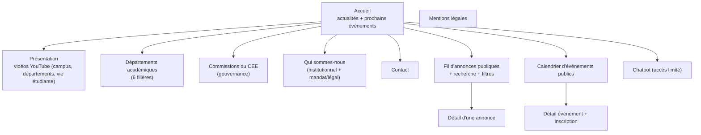

# 🎨 Plateforme CEE — Cahier des charges & directives Design System

> [!info] Contexte de cet envoi
> Suite à la demande du chef d'équipe Design System, voici le cahier des charges complet de la **Plateforme CEE** ainsi que les directives spécifiques dont l'équipe Design System a besoin pour nous accompagner. Ce document est un résumé orienté design — le cadrage produit complet (décisions, justifications, points ouverts) vit dans [[Plateforme_CEE_Fusion]] si vous avez besoin de contexte supplémentaire sur une décision.

---

## 1. 🎯 Présentation du projet

La **Plateforme CEE** est l'outil numérique officiel du Comité Exécutif des Étudiants de l'ESP : vitrine publique, canal de diffusion d'annonces et d'événements, réseau social étudiant, et chatbot d'assistance. Développée par des étudiants, budget 0 FCFA, hébergement mutualisé.

**Ce que ça implique pour vous** : c'est un produit **une seule app, un seul déploiement**, avec plusieurs vues selon qui consulte (visiteur non connecté, étudiant connecté, personne avec des droits d'administration). Pas de sites séparés — une cohérence visuelle forte entre les vues est donc essentielle.

> [!success] Le design system existant est notre socle
> Nous **consommons votre design system existant** — nous ne demandons pas de nouvelle identité visuelle ni de nouvelle charte. Ce document sert à vous dire **comment** nous allons l'utiliser et **quels écrans/composants** nous allons construire avec, pas à rouvrir la charte.

---

## 2. 🔐 Modèle d'accès (impact direct sur la navigation)

| Profil | Qui | Ce qu'il voit |
|---|---|---|
| **Visiteur** | Tout le monde, sans compte | Vitrine, actualités publiques, chatbot (limité) |
| **Étudiant** | Compte Google reconnu (liste blanche gérée par les structures départementales) | Tout le visiteur + fil interne, réseau social, événements internes |
| **Droits d'administration** (Éditeur / Modérateur / Admin) | Attribués localement, cumulables avec le statut Étudiant | Tableau de bord + fonctions de publication/modération |

**Directive de navigation** : nous voulons des **layouts communs** (même structure de header/footer/composants) entre ces profils, avec une **bifurcation du contenu du menu selon le rôle** — pas des chrome entièrement différents par profil. Un composant de navigation adaptable au rôle connecté est donc central pour nous.

> [!important] Barre Polyspace (suite à la réunion du 3 octobre)
> Notre navigation par rôle **coexiste** avec la barre Polyspace (navigation verticale rétractable inter-plateformes, logos des applications du CEE, app active en surbrillance — bouton unique sur mobile). C'est le minimum commun exigé pour toute plateforme de l'écosystème. Elle se place **au-dessus** de notre propre chrome, pas à la place. Un header de structure similaire aux autres plateformes est "souhaitable mais pas obligatoire" selon le compte rendu — on s'alignera sur votre recommandation.

Connexion **uniquement via Google** (bouton "Se connecter avec Google") — pas de formulaire email/mot de passe à designer.

---

## 3. 🗺️ Inventaire complet des écrans

### 3.1 Vue Visiteur (public, sans connexion)

| Écran | Notes design |
|---|---|
| Accueil | Bloc actualités + bloc "prochains événements" + accès rapides vers les rubriques |
| Présentation | Grille/carrousel de vidéos, **miniature cliquable** (le lecteur YouTube ne se charge qu'au clic, pas au chargement de page) |
| Départements académiques | 6 fiches (Génie Informatique, Génie Mécanique, Génie Chimique et Biologie Appliquée, Génie Électrique, Génie Civil, Gestion) |
| Commissions du CEE | Liste des commissions (gouvernance), structure encore à recevoir de notre côté — prévoir un composant "liste d'entités" réutilisable |
| Qui sommes-nous | Page à 2 sections : histoire/missions/bureau exécutif, puis mandat/règlement intérieur |
| Fil d'annonces | Liste chronologique, recherche texte, filtre par étiquette (tags libres, pas de taxonomie fermée) |
| Détail annonce | Titre, corps, pièces jointes (PDF/image/vidéo), étiquettes, date, éventuel ciblage département/classe affiché |
| Calendrier événements | Vue liste et/ou calendrier, distinction public/interne, capacité affichée si limitée (+ liste d'attente) |
| Chatbot | Widget conversationnel, réponses **sourcées** (lien vers l'annonce/page d'origine), état "je ne sais pas" avec formulaire de contact (ticket), **compteur de questions restantes** pour les visiteurs |

### 3.2 Vue Étudiant (connecté)

Tout ce qui précède, **plus** :

| Écran | Notes design |
|---|---|
| Fil d'annonces internes | Mêmes composants que le fil public + annonces ciblées par département/classe |
| Réseau social — fil | Posts (texte/image/vidéo), commentaires, réactions |
| Groupes | Liste de groupes (auto-créés par département/promo), page de groupe |
| Messagerie privée | Liste de conversations + thread — **différée, pas de temps réel** (pas d'indicateur "en train d'écrire" ou de présence live à prévoir) |
| Profil étudiant | Édition (compétences, projets, recherche stage/alternance) |
| Annuaire | Recherche par promo / département / compétences |
| Social (signalements) | Formulaire de signalement avec **choix explicite public/confidentiel** par l'utilisateur |
| Sport & Culture | Liste d'activités/clubs/tournois |
| Relations extérieures | Liste de partenaires/offres |
| Espace Alumni | **Un simple lien/carte "pont"** vers la plateforme du réseau Alumni — pas d'annuaire à designer ici |
| Ajout étudiant manquant | Écran simple réservé aux responsables de classe : formulaire d'ajout à leur classe |
| Chatbot | Même widget que visiteur, sans limite de questions |

### 3.3 Vue Admin (droits Éditeur / Modérateur / Admin)

| Écran | Rôle concerné | Notes design |
|---|---|---|
| Tableau de bord | Tous | Vue d'accueil admin, contenu du menu adapté au(x) rôle(s) de la personne |
| Créer/éditer une annonce | Éditeur | Formulaire avec **brouillon**, **épinglage**, **date d'expiration**, ciblage département/classe, upload pièces jointes (PDF/image/vidéo) |
| Créer/éditer un événement | Éditeur | Formulaire avec date/lieu, public/interne, capacité (illimitée ou plafonnée + liste d'attente) |
| Gestion contenu vitrine | Éditeur | Édition des pages statiques (Qui sommes-nous, Contact, Départements, Commissions) — pas de redéploiement, tout est en base |
| Gestion vidéos Présentation | Éditeur | Ajout/retrait de liens YouTube, ordre d'affichage |
| File de signalements | Modérateur | Liste des signalements réseau social à traiter (approuver/masquer/escalader) |
| Gestion des comptes | Admin | Import Excel (structures départementales), suivi des imports (aperçu erreurs), vue des comptes |
| Gestion des rôles | Admin | Attribution/retrait des droits Éditeur/Modérateur/Admin |
| Journal d'audit | Admin | Table de toutes les actions du tableau de bord (qui/quoi/quand) — probablement un tableau filtrable/paginé |

### 3.4 Composants transverses nécessaires

| Composant | Usage | Particularité |
|---|---|---|
| Navigation adaptable au rôle | Toutes les vues | Un seul layout, contenu de menu variable |
| Toggle mode sombre | Toutes les vues | Suit la préférence système par défaut + override manuel |
| Lecteur vidéo différé | Présentation, réseau social | Miniature + clic pour charger (perf) |
| Widget chatbot | Toutes les vues | États : réponse normale (sourcée), "je ne sais pas" + ticket, compteur de questions (visiteur) |
| Carte "pont" externe | Espace Alumni | Renvoi visuel vers une autre plateforme, pas un vrai contenu local |
| Formulaire d'import avec aperçu d'erreurs | Admin | Upload Excel → aperçu des lignes en erreur avant validation |
| Table admin filtrable/paginée | Gestion comptes, journal d'audit | Réutilisable pour plusieurs écrans admin |
| Bannière d'installation PWA | Toutes les vues (mobile) | Invite à installer l'app |
| Notification/toast | Transverse | Retour d'action (annonce publiée, erreur formulaire, etc.) |
| Badge de statut | Annonces/dépenses-like | Brouillon / Publié / Expiré / Épinglé |
| Calendrier / liste d'événements | Visiteur + Étudiant | Vue combinée date + lieu + capacité |
| **Barre Polyspace** | Toutes les vues | Navigation verticale rétractable inter-plateformes, logos + surbrillance app active, bouton unique sur mobile — composant écosystème, pas propre à nous (voir directive ci-dessus) |
| Badge "Compte supprimé" | Réseau social, journal d'audit | Remplace le nom d'un auteur dont le compte a été purgé côté moteur d'auth (inactivité 6 mois) — le contenu reste affiché, l'identité est anonymisée |

---

## 4. 📐 Directives transverses

> [!important] Mobile-first — priorité absolue
> L'interface est pensée **d'abord pour smartphone**. La plateforme est installable comme **PWA dès le premier jalon** de développement. Chaque composant doit être conçu/testé mobile en premier, desktop en second. Nous testons sur device physique réel avant chaque livraison, pas seulement en émulateur.

> [!important] Accessibilité — WCAG 2.1 AA
> Cible réaliste vu nos moyens humains (1 QA) : audit automatisé + checklist manuelle, pas une certification exhaustive avec tests lecteurs d'écran. Merci de nous fournir des composants déjà conformes autant que possible (contrastes, focus visible, aria).

> [!important] Mode sombre
> Suit la **préférence système** de l'appareil par défaut, avec un **toggle manuel** pour la court-circuiter. Comportement à documenter clairement si votre design system a déjà un standard pour ça.

> [!important] Performance
> Cible Lighthouse > 90 sur la vitrine, y compris avec des vidéos intégrées — d'où le besoin du composant "lecteur vidéo différé" (chargement au clic seulement). Merci de nous alerter si un pattern de votre design system est lourd par défaut (animations, polices, images non optimisées).

> [!note] Contenu lisible sans JavaScript
> Le contenu de lecture de base (annonces, pages statiques) doit rester consultable même sans JS actif (rendu serveur). Les interactions (filtres, recherche, réseau social) peuvent nécessiter JS. Si vos composants reposent lourdement sur du JS pour un affichage de base, prévenez-nous — ça peut nécessiter un fallback.

> [!note] Pas d'authentification par mot de passe à designer
> La connexion se fait exclusivement via un bouton "Se connecter avec Google" (OAuth2, moteur d'authentification mutualisé avec d'autres plateformes étudiantes). Aucun écran de mot de passe, de récupération de compte ou de 2FA à concevoir de notre côté.

---

## 5. ❓ Points sur lesquels on aimerait votre retour

- Avez-vous déjà des composants pour un **widget de chat conversationnel** (bulles de message, état de frappe désactivé puisqu'on n'a pas de temps réel, citation de source) ? Sinon, c'est un composant qu'on devra construire ensemble.
- Avez-vous un pattern pour une **table de données admin** (filtrable, paginée, avec actions par ligne) réutilisable pour plusieurs de nos écrans (gestion comptes, journal d'audit) ?
- Avez-vous un composant de **lecteur vidéo à chargement différé** (miniature + clic) déjà standardisé, ou c'est à nous de le construire selon vos guidelines visuelles ?
- Un pattern pour les **formulaires avec aperçu d'erreurs avant validation** (notre cas : import Excel) existe-t-il déjà ?
- Comment souhaitez-vous qu'on gère les **écrans vides** (ex. réseau social sans encore de contenu au lancement) ? Avez-vous un standard d'"empty state" ?
- **Barre Polyspace** : le compte rendu du 3 octobre mentionne un débat non tranché (composant partagé vs recréé par chaque équipe, React vs Next.js chez nous). Où en est cette décision ? Si un composant de référence existe déjà (même partiel), on préfère partir de ça plutôt que de recréer quelque chose d'incohérent avec les autres plateformes.
- Avez-vous un standard pour un **badge "compte supprimé/désactivé"** (cas d'un étudiant dont le compte a été purgé après inactivité) ?

---

## 6. 🎨 Logo de la Plateforme CEE

Suite à la demande du 3 octobre, chaque équipe doit proposer son logo dans le groupe Google pour que vous le récupériez. **Nous allons désigner un responsable côté Plateforme CEE pour cette tâche** (en cours, voir [[Plateforme_CEE_Fusion]] §14). Merci de nous indiquer si vous avez un format/gabarit attendu (dimensions, fond transparent, variantes clair/sombre) pour qu'on parte directement sur la bonne base.

---

## 7. 📇 Contact côté Plateforme CEE

- **Tech Lead** : moi-même (porteur de ce document)
- **Interlocuteur Design System désigné côté Plateforme CEE** : à confirmer en interne, un point de contact unique sera assigné pour toute question de suivi
- Document de cadrage complet (décisions, justifications, points ouverts) : [[Plateforme_CEE_Fusion]]

N'hésitez pas à revenir vers nous pour toute clarification sur les écrans, le contenu attendu, ou les contraintes techniques listées ici.
